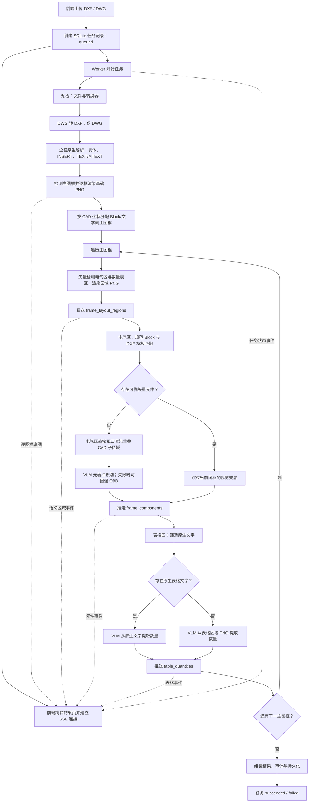

# 主识别任务流与前端实时进度反馈

## 概览

上传完成后，前端立即进入结果页，并通过 Server-Sent Events（SSE）订阅任务状态。任务事件先持久化到 SQLite，再通知 SSE 流；前端使用首个任务快照初始化，此后不以定时轮询查询进度。

主任务以**主图框**为业务边界，以**矢量证据优先、视觉补盲、表格独立提取**为原则。它与用户在完成结果上发起的“区域重提取”是两条不同的路径：前者由 Worker 异步执行并持续推送 SSE，后者当前是一个长时间 HTTP 请求。



## 目标任务阶段与前端反馈

| 阶段 / 进度范围 | 后端内部工作 | SSE `currentWork` / 前端实时反馈 |
|---|---|---|
| 上传完成、任务入队 / 0% | 创建 `queued` 任务和首条事件，提交本地 Worker。 | 等待识别。 |
| 预检 / 10% | 校验文件、DXF/DWG 入口和转换器可用性。 | `preflight`、用户说明。 |
| 原生解析 / 25% | 仅读取一次 DXF；审计实体，解析顶层 `INSERT`、`TEXT/MTEXT`，评估原生文字可用性。 | `vector_parse`、用户说明。 |
| 主图框与基础图渲染 / 35% 起 | 检测主图框，逐图框渲染基础 PNG 并产生 `baseImages`。 | `drawing_frames`、主图框总数；已生成底图可直接切换查看。 |
| 图框语义分区 / 约 39–53% | 在每个主图框内检测一个电气区和至多一个表格区，持久化高 DPI 区域 PNG。 | `frame_layout_regions`，区域 CAD 范围、类别、置信度和证据；覆盖层立即显示。 |
| 图框矢量识别 / 约 38–52% | 按图框归属筛选 Block/原生文字；电气区内执行规范 Block 和按类别的 DXF 模板匹配。 | `frame_vector_parse`、`template_match`，含图框/模板序号和模板名。 |
| 电气视觉兜底 / 约 53–88% | 仅无可靠矢量候选的图框，按电气区规划重叠 CAD 子区域，直接视口渲染并执行 VLM；可配置 OBB 回退。 | `vlm_component_frame`、`vlm_component_tile`，随后 `frame_components` 增量更新侧栏。 |
| 表格数量提取 / 约 90–99% | 只处理确认的表格区：原生文字存在时走文字路径，否则走表格 PNG VLM 路径。 | `table_quantity_extraction`，完成后 `table_quantities` 增量显示表格。 |
| 组装与结束 / 94–100% | 组装组件、文字、表格、图框、审计与限制项，保存完整结果。 | `fusion` 后发送 `done`；失败时发送 `error` 和错误文本。 |

> **进度解释**：进度是用户可理解的阶段性估算，不是已处理实体比例。主图框数、模板数、子区域数、VLM 响应时间与表格数量均会影响某一阶段停留时长；尤其是 VLM 节流等待和模型响应期间，进度可能暂时不变化。

## 合理性与处理原则

该流程是合理的，并且比“先对整张图解析，再统一做视觉识别”更符合多主图框电气图纸的业务边界：

1. **主图框是处理单元**：元器件、文本和渲染坐标都归属同一主图框，避免跨图框错误关联。
2. **先矢量、后视觉**：DXF 模板匹配可利用精确几何、坐标和比例信息；VLM 仅处理没有可靠矢量结论的主图框，并按 CAD 范围划分重叠子区域后直接渲染，避免对已渲染的主图框 PNG 再裁切。
3. **模板命中不是无条件通过**：应以结构分数、缩放合理性和重复结构作为可靠性门槛；当前主流程只要存在可靠矢量候选即跳过该图框 VLM，低分或局部覆盖的 VLM 复核属于后续增强。
4. **原生 Block 识别应并行保留**：已知规范块名的 `INSERT` 是高可信确定性证据，不应被模板匹配取代；它和模板匹配共同构成 VLM 前的矢量识别层。
5. **表格语义独立于图符定位**：当前不再用最近邻将原生文字自动关联至元器件。数量表仅在确认的 `table_region` 内提取，输出独立清单及来源/证据；它不生成元器件位置。

实现层面可只读取一次 DXF 文档以降低开销；“逐图框解析”指按图框范围筛选和组织实体、Block、文字，而非每个图框重复读取整个文件。

## 当前实现与目标流程的差异

当前上传后的主识别流程已经按主图框执行模板匹配、视觉兜底和表格双路径提取，也会在结果中保留图框归属；仍存在以下实现边界：

1. DXF 实体、Block、原生文字目前在进入主图框循环前统一解析，之后才按 CAD 中心点写入 `frame_index`；这避免重复读取 DXF，但尚未递归提取块内文字。
2. 已配置类型的模板会在各图框内优先匹配；模板清单为空时没有模板可匹配，所有没有已知 Block 的图框都会进入 VLM 兜底。
3. 当前 VLM 兜底粒度是“主图框”：该图框存在可靠 Block 或模板候选时跳过 VLM，否则处理该图框的全部重叠 CAD 子区域。更细的“跳过模板已覆盖的单个区域”掩膜尚未实现。
4. 每个视觉子区域通过 DXF 视口直接渲染；检测框用该子区域实际像素尺寸和 CAD 范围直接回写 CAD 坐标，跨重叠子区域的元件按 CAD 框 IoU 去重。
5. 当前 SSE 会真实反馈模板序号、VLM 图框/切片进度、图框元件、语义区域和已完成数量表。表格路径是“原生文字优先、表格图像 VLM 兜底”；不是对电气切片做通用 VLM 文字关联。
6. 上传成功后，结果页建立 SSE 连接；主图框底图生成后会携带在任务快照的 `baseImages` 中，结果页可在识别继续期间切换和查看已生成图框。`frame_components`、`frame_layout_regions`、`table_quantities` 会实时进入侧栏/覆盖层；`done` 到达后再加载完整元件、文字、表格和区域接口作为最终一致性刷新。
7. 单个表格的 VLM 提取失败会记录到审计限制项，不会使已完成的主任务整体失败；该表不会产生 `table_quantities` 成功事件。电气区视觉识别失败同样保留已获得的矢量/表格结果，并在审计中说明原因。

## SSE 数据模型

任务状态包含以下前端可用字段：

- `status`：`pending`、`processing`、`completed`、`failed`。
- `progress`：整体进度百分比。
- `phase`：当前阶段标识，例如 `frame_layout_regions`、`template_match`、`vlm_components`、`table_quantity_extraction`、`fusion`。
- `message`：面向用户的当前工作说明。
- `currentWork`：结构化细粒度任务信息。

`currentWork` 的典型示例：

```json
{
  "kind": "frame_layout_regions",
  "frame_index": 1,
  "frame_total": 4,
  "frame_name": "region_02",
  "layout_regions": [
    {
      "id": "1:region_02_electrical",
      "frameIndex": 1,
      "kind": "electrical",
      "cadExtent": [10, 20, 180, 120],
      "confidence": 0.92,
      "evidence": {"...": "..."}
    }
  ]
}
```

`vlm_component_tile` 时，前端可展示“主图框 2/4，区域 5/12”；`frame_layout_regions` 和 `table_quantities` 还会直接驱动结果页的区域覆盖层和数量表。

结果页对 SSE 的处理规则如下：

1. 上传接口返回 `taskId` 后立即跳转到结果页，不等待识别完成；
2. 结果页先读取一次任务快照并建立 SSE 订阅；这仅用于初始化，不会循环请求状态；
3. 每个 `progress` 事件更新阶段、进度、当前工作和已可用的主图框底图；
4. `frame_components`、`frame_layout_regions`、`table_quantities` 先增量更新可展示结果；任务完成事件到达后再加载完整元件、文字、表格和区域数据；
5. 浏览器 `EventSource` 断线时保留其自动重连能力，不由前端关闭后改用轮询。

> **当前边界**：事件中的元件/区域/表格结果用于实时展示，但完整 `result_json` 仍只在任务结束时持久化。因此浏览器在任务中途刷新后，只能从最近一条 `currentWork` 恢复有限中间状态，不能恢复完整的逐图框历史结果。

## VLM 请求节流与失败语义

所有主任务中的 VLM HTTP 请求共用 `DRAWING_VLM_REQUEST_INTERVAL_SECONDS`：

- 值为 `0`：不额外等待；
- 值为正数 $N$：同一**后端进程**中，相邻两次 VLM 请求的开始时间至少间隔 $N$ 秒；
- 适用范围：电气元器件 VLM、遗留的文字提取适配器、表格原生文字数量提取、表格图像数量提取；
- 不适用范围：不同后端进程或多副本之间不会互相节流，需要在网关、队列或模型服务端另行限流。

节流仅限制请求起点，不会取消已开始的请求。发生 HTTP 错误、不可达或超时时，各调用方记录安全的失败分类和审计信息；日志和 SSE 不得包含密钥、端点、完整提示词或图像数据。

## 完成后的区域重提取（非主任务）

当任务处于 `succeeded` 后，结果页可以编辑 `electrical_region` 或 `table_region` 的覆盖框并调用 `POST /api/recognition/{taskId}/layout-regions/reextract`。流程如下：

1. 前端将编辑后的归一化画布框换算为所属主图框的 `cad_extent`；
2. 后端验证区域类型、主图框索引、正宽高，以及新范围完整位于主图框内；
3. 后端重新直接渲染该 CAD 区域；表格区调用表格图像 VLM，电气区调用视觉元器件识别；
4. 成功后替换该区域对应的表格记录或该主图框的视觉元件记录，更新完整任务结果；前端强制刷新最终接口数据。

此路径的渲染和 VLM 调用在工作线程中运行，以避免阻塞 FastAPI 事件循环；但请求本身仍同步等待结果，前端请求超时设为 20 分钟，并在请求期间禁用其他重提取按钮。它不会产生主任务的增量 SSE 结果。多浏览器/多用户同时编辑同一任务尚无乐观锁，后提交者可能覆盖先提交者；需要任务化、版本号与完成事件后再支持协作式操作。

## 模板匹配进度

独立 DXF 元器件模板匹配工具已支持进度回调，回调包含：

- 模板序号和模板总数；
- 当前模板文件名；
- `template_match` 工作类型。

模板匹配已接入上传主流程。默认从 `backend/data/runtime/reference-icons/<component_type>/**/*.dxf` 读取按目录分类的模板；`DRAWING_TEMPLATE_MANIFEST` 可补充部署专用模板。`DRAWING_TEMPLATE_MATCHING_ENABLED=false` 可完全关闭模板阶段。每条模板必须有明确的 `component_type`，不能仅根据 DXF 文件名猜测元器件类别。

每个主图框会按清单顺序推送模板进度；模板和原生 Block 都没有产生可靠矢量候选时，才推送该图框的 VLM 区域进度。

## 当前未细化反馈的工作

以下步骤已执行或可能执行，但尚未提供独立的细粒度前端事件：

1. DWG 转 DXF 的转换器内部子步骤，例如转换开始、进行中和完成。
2. 区域 PNG 渲染的逐区域进度；主图框基础 PNG 已有 `frame_render` 事件。
3. 当前主图框 DXF 实体筛选、Block 识别和原生文字解析的实体级进度。
4. 单次 VLM 请求的上传图片、节流等待、等待模型响应、解析返回内容等网络子状态。
5. 表格 VLM 失败的独立 SSE 失败事件；当前仅在最终审计限制项中反映。
6. 上传历史列表中的失败错误详情展示；后端任务结果包含错误信息，但上传列表尚未单独显示。

## 关键处理日志

所有日志同时写入控制台和 `backend/logs/drawing-recognition.log`。关键日志不记录 API 密钥、端点、完整提示词或图像内容。

| 日志范围 | 记录内容 |
|---|---|
| 图纸任务编排 | 开始、DWG 转换、DXF 原生解析及文字可用性、主图框数量、基础/语义区域渲染、完成汇总 |
| 模板匹配 | 模板清单加载结果、图框几何规模、当前模板序号/名称/类型、原始匹配数、通过置信度阈值的候选数 |
| VLM 元器件识别 | 图框开始、渲染尺寸、切片数量、每个切片开始/结束、原始检测数、耗时、OBB 回退、图框合并结果 |
| VLM 表格数量提取 | 原生文字数或表格图像尺寸、请求开始/结束、来源路径、组件记录数、耗时及失败类别 |
| VLM 适配器与节流 | 模型标识、切片/图像名、特征描述数量、超时配置、节流等待、请求结果、检测/数量记录及安全的失败类别 |

通过任务 SSE 可以观察处理进度；通过控制台或日志文件可以进一步定位具体的模板、图框、切片及模型调用耗时。

## 相关实现位置

- `backend/runtime/repository.py`：任务与结构化事件持久化、事件通知。
- `backend/runtime/worker.py`：任务阶段编排与进度回调写入。
- `backend/service.py`：图纸识别主流程的阶段回调。
- `backend/recognition/vision_pipeline.py`：VLM 图框与区域级进度回调。
- `backend/recognition/template_detector.py`：运行时模板加载开关与图框内模板匹配。
- `backend/tools/extract_table_component_quantities.py`：原生文字与表格图像的数量提取。
- `backend/api.py`：SSE 流接口与前端任务数据转换。
- `frontend/src/api/recognition.ts`：EventSource 订阅。
- `frontend/src/pages/Result/ResultPage.tsx`：结果页增量消费元件、区域和表格事件，并在完成后刷新完整结果。
- `frontend/src/pages/Result/CanvasViewer/`：语义区域覆盖层、编辑和重提取入口。
