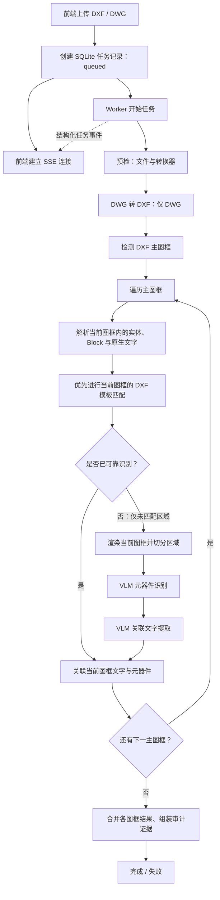

# 任务流与前端实时进度反馈

## 概览

上传图纸后，前端通过 Server-Sent Events（SSE）订阅任务状态。任务事件持久化到 SQLite，后端在产生新事件时通知 SSE 流；前端不再以定时轮询方式查询任务进度。



## 目标任务阶段与前端反馈

| 阶段 | 后端内部工作 | 前端实时反馈 |
|---|---|---|
| 上传完成、任务入队 | 创建任务记录 | 等待识别 |
| Worker 启动 / 预检 | 校验图纸和转换器配置 | 阶段、进度、说明 |
| 主图框检测 | 识别主图框并确定识别范围 | 主图框总数 |
| 当前图框 DXF 解析 | 仅收集当前主图框范围内的实体、Block 与原生文字 | 主图框序号/总数、解析阶段 |
| 当前图框模板匹配 | 逐模板在当前主图框范围内做矢量匹配 | 主图框序号/总数、模板序号/总数、模板名 |
| VLM 元器件兜底 | 仅对模板未可靠识别的区域渲染、切分并调用 VLM | 主图框序号/总数、区域序号/总数 |
| VLM 关联文字提取 | 对当前图框需要补充的区域提取组件相关文字 | 主图框序号/总数、区域序号/总数 |
| 当前图框结果融合 | 关联该图框的元器件与文字，并进入下一图框 | 主图框序号/总数、阶段、说明 |
| 全局结果组装 | 合并各主图框结果、组装审计证据 | 阶段、进度、说明 |
| 成功或失败 | 保存结果或错误 | 最终状态、进度；任务接口保留错误信息 |

## 合理性与处理原则

该流程是合理的，并且比“先对整张图解析，再统一做视觉识别”更符合多主图框电气图纸的业务边界：

1. **主图框是处理单元**：元器件、文本和渲染坐标都归属同一主图框，避免跨图框错误关联。
2. **先矢量、后视觉**：DXF 模板匹配可利用精确几何、坐标和比例信息；VLM 只处理模板没有可靠结论的区域，降低请求数量和误报概率。
3. **模板命中不是无条件通过**：应以结构分数、缩放合理性、重复结构和必要的文字证据作为可靠性门槛；低分或冲突候选仍应交给 VLM 复核。
4. **原生 Block 识别应并行保留**：已知规范块名的 `INSERT` 是高可信确定性证据，不应被模板匹配取代；它和模板匹配共同构成 VLM 前的矢量识别层。
5. **文字关联应在图框内完成**：原生文字与 VLM 文字都只可关联到同一主图框内的具体元器件。

实现层面可只读取一次 DXF 文档以降低开销；“逐图框解析”指按图框范围筛选和组织实体、Block、文字，而非每个图框重复读取整个文件。

## 当前实现与目标流程的差异

当前上传后的主识别流程已经按主图框执行模板匹配与 VLM 兜底，也会在结果中保留图框归属；仍存在以下实现边界：

1. DXF 实体、Block、原生文字目前在进入主图框循环前统一解析，之后才按图框归属关联。
2. 已配置类型的模板会在各图框内优先匹配；模板清单为空时没有模板可匹配，所有没有已知 Block 的图框都会进入 VLM 兜底。
3. 当前 VLM 兜底粒度是“主图框”：该图框存在可靠 Block 或模板候选时跳过 VLM，否则处理该图框的全部切片。更细的“跳过模板已覆盖的单个区域”掩膜尚未实现。
4. 当前 SSE 会真实反馈模板序号，以及 VLM 的图框和区域进度。

## SSE 数据模型

任务状态包含以下前端可用字段：

- `status`：`pending`、`processing`、`completed`、`failed`。
- `progress`：整体进度百分比。
- `phase`：当前阶段标识，例如 `template_match`、`vlm_components`、`vlm_text`。
- `message`：面向用户的当前工作说明。
- `currentWork`：结构化细粒度任务信息。

`currentWork` 的典型示例：

```json
{
  "kind": "vlm_component_tile",
  "frame_index": 1,
  "frame_total": 4,
  "frame_name": "region_02",
  "tile_index": 4,
  "tile_total": 12,
  "tile_name": "tile_005.png"
}
```

前端上传页面的“当前工作”列据此展示例如“主图框 2/4，区域 5/12”。

## 模板匹配进度

独立 DXF 元器件模板匹配工具已支持进度回调，回调包含：

- 模板序号和模板总数；
- 当前模板文件名；
- `template_match` 工作类型。

模板匹配已接入上传主流程。默认从 `backend/data/component-templates.json` 读取模板；清单为空时保持 VLM 兜底行为。每条模板必须显式填写 `component_type`，不能仅根据 DXF 文件名猜测元器件类别。也可通过 `DRAWING_TEMPLATE_MANIFEST` 指向部署专用清单。

每个主图框会按清单顺序推送模板进度；模板和原生 Block 都没有产生可靠矢量候选时，才推送该图框的 VLM 区域进度。

## 当前未细化反馈的工作

以下步骤已执行或可能执行，但尚未提供独立的细粒度前端事件：

1. DWG 转 DXF 的转换器内部子步骤，例如转换开始、进行中和完成。
2. 主图框 PNG 渲染的逐图框进度。
3. 当前主图框 DXF 实体筛选、Block 识别和原生文字解析的细粒度进度。
4. 单次 VLM 请求的上传图片、等待模型响应、解析返回内容等网络子状态。
5. 上传历史列表中的失败错误详情展示；后端任务结果包含错误信息，但上传列表尚未单独显示。

## 关键处理日志

所有日志同时写入控制台和 `backend/logs/drawing-recognition.log`。关键日志不记录 API 密钥、端点、完整提示词或图像内容。

| 日志范围 | 记录内容 |
|---|---|
| 图纸任务编排 | 开始、DWG 转换、DXF 原生解析数量、主图框数量、文字关联、底图渲染、完成汇总 |
| 模板匹配 | 模板清单加载结果、图框几何规模、当前模板序号/名称/类型、原始匹配数、通过置信度阈值的候选数 |
| VLM 元器件识别 | 图框开始、渲染尺寸、切片数量、每个切片开始/结束、原始检测数、耗时、OBB 回退、图框合并结果 |
| VLM 文字提取 | 图框和切片开始/结束、原始文字数、保留文字数、耗时 |
| VLM 适配器 | 模型标识、切片名、参考图数量、超时配置、请求结果、检测/文字数量、耗时及安全的失败类别 |

通过任务 SSE 可以观察处理进度；通过控制台或日志文件可以进一步定位具体的模板、图框、切片及模型调用耗时。

## 相关实现位置

- `backend/runtime/repository.py`：任务与结构化事件持久化、事件通知。
- `backend/runtime/worker.py`：任务阶段编排与进度回调写入。
- `backend/service.py`：图纸识别主流程的阶段回调。
- `backend/recognition/vision_pipeline.py`：VLM 图框与区域级进度回调。
- `backend/tools/match_dxf_component_templates.py`：模板序号级进度回调。
- `backend/api.py`：SSE 流接口与前端任务数据转换。
- `frontend/src/api/recognition.ts`：EventSource 订阅。
- `frontend/src/pages/Upload/UploadPage.tsx`：上传页实时进度和当前工作展示。
