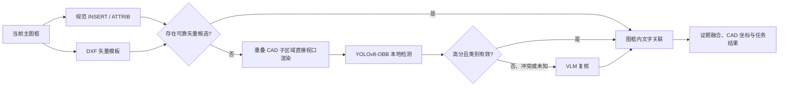

# 电气 CAD 图纸深度学习检测方案：YOLOv8-OBB

> **状态**：实施方案；训练数据、权重和生产编排均未完成。  
> **日期**：2026-08-05  
> **关联主方案**：[电气图纸元件识别可行技术方案.md](电气图纸元件识别可行技术方案.md)

---

## 1. 目标与边界

本方案使用 **YOLOv8-OBB** 检测打散、旋转或表达不统一的电气元器件符号，补足规范 `INSERT` 和 DXF 矢量模板匹配无法稳定覆盖的图纸变体。

它的目标是从当前主图框的 CAD 子区域渲染图中输出：

- 已登记业务类别的 `component_type`；
- 旋转框中心、宽高、角度和置信度；
- 对应 CAD 中心点、子区域来源和模型版本证据；
- 供后续图框内文字关联与候选融合使用的元件候选。

它**不负责**：

- 通过位号、参数或文字单独产生元器件；
- 提取标题栏、尺寸、线号或普通文字；
- 替换规范 Block 和 DXF 模板的确定性识别；
- 对整张巨幅图纸直接滑窗推理；
- 在没有真实图纸评测时承诺识别精度。

## 2. 为什么选择 YOLOv8-OBB

普通 YOLO Detect 输出水平框。电气图纸中的符号可能旋转、密集排列、被导线穿过；水平框会引入大面积背景、文字和邻近导线。YOLOv8-OBB 的旋转框更贴近符号图形本体，可输出中心点、宽度、高度和角度，适合当前的 CAD 坐标回写链路。

| 能力 | 规范 Block | DXF 模板 | YOLOv8-OBB | VLM |
|---|---|---|---|---|
| 明确 CAD 语义 | 强 | 强 | 中 | 弱 |
| 对打散符号有效 | 弱 | 中 | 强 | 中 |
| 对旋转/缩放鲁棒 | 取决于 Block | 中 | 强 | 中 |
| 需要标注数据 | 否 | 模板 | 是 | 否 |
| 推理成本和延迟 | 低 | 低 | 中 | 高 |
| 可重复性 | 强 | 强 | 强 | 受模型服务影响 |
| 当前状态 | 已实现 | 已实现，未做真实精度验证 | 仅预留推理入口 | 已实现兜底，未做真实精度验证 |

## 3. 在当前任务流中的位置



当前实现是“VLM 为首选、OBB 在 VLM 失败时回退”。在获得可接受的独立评测结果后，目标实现应变为“高分 OBB 为首选、VLM 仅复核低分/冲突/未知类别”。

## 4. 训练数据设计

### 4.1 样本单位与数据泄漏控制

训练样本必须复用生产环境的视觉输入：从主图框按 CAD 范围规划重叠子区域，并直接限制 DXF 视口渲染 PNG。每个样本需要保存：

- 原始图纸唯一标识和来源版本；
- 主图框标识、`frame_index`、CAD 子区域 `cad_extent`；
- 渲染 DPI、字体替代、背景、线宽、目标像素尺寸和重叠参数；
- PNG 文件与 OBB 标注；
- 是否为真实图纸、受控合成图或人工复核难例；
- 标注人、复核状态和数据集版本。

训练、验证、测试必须按**原始图纸**划分，不能把同一图纸的重叠子区域随机拆分到不同集合。建议初始划分为：

$$
\text{train} : \text{validation} : \text{test} = 70 : 15 : 15
$$

若图纸数量较少，应优先保证独立测试图纸来源不同于训练图纸，而不是机械追求上述比例。

### 4.2 类别治理

训练类别名称必须等于 [backend/recognition/component_catalog.py](../backend/recognition/component_catalog.py) 中的稳定英文 `component_type`。禁止用中文名称、供应商编号或 `01.dxf` 之类文件名作为模型类别。

首个可评测版本建议优先训练符号边界明确、业务价值高且图纸变体相对可控的类别：

- `circuit_breaker`；
- `fuse`；
- `current_transformer`；
- `voltage_transformer`；
- `surge_arrester`；
- `grounding_switch`；
- `capacitor`；
- `ammeter`；
- `voltmeter`；
- `transformer`。

组合关系强、外观变体多的类别应在首版稳定后再引入。每个类别至少收集正例、易混淆反例、旋转例、不同图层/线宽例和密集邻近例。

### 4.3 标注规范

使用 OBB 四角点标注，每行形如：

```text
<class_id> <x1> <y1> <x2> <y2> <x3> <y3> <x4> <y4>
```

强制规则：

1. 框只覆盖元器件**图形本体**，不包含位号、参数、相邻导线、标题或尺寸。
2. 位号如 `QF1` 是后续文字关联证据，不是检测框的一部分。
3. 导线穿过符号时，按完整符号本体的最小合理旋转框标注。
4. 同一符号出现在重叠 CAD 子区域时可保留多份训练标注，但所有副本必须属于同一训练/验证/测试集合。
5. 无法确认类别的符号必须进入待复核池或忽略区，不能强行标为最接近的类别。
6. 标注工具导出后须校验四点顺序、凸性、图像边界和类别编号。

### 4.4 数据增强

增强必须模拟 CAD 渲染差异，不应照搬自然图像的强透视和色彩增强。

| 增强 | 建议 | 说明 |
|---|---|---|
| $0^\circ/90^\circ/180^\circ/270^\circ$ 旋转 | 推荐 | 覆盖常见图纸方向；同步更新 OBB 四点。 |
| 小范围旋转和缩放 | 推荐 | 模拟插入比例和轻微制图差异。 |
| 线宽、抗锯齿、轻微模糊/压缩 | 推荐 | 提升不同导出链路的鲁棒性。 |
| 轻微亮度/对比度变化 | 可选 | 适应底色和截图差异。 |
| Mosaic / 大规模拼贴 | 谨慎 | 可能破坏符号与导线的真实关系。 |
| 透视变换 | 不推荐 | 标准 CAD 视图通常不存在透视畸变。 |
| 镜像 | 谨慎 | 部分电气符号镜像后语义改变。 |

合成数据可以用于扩充罕见类别，但验证集和测试集必须包含真实图纸，且不得以合成指标代替真实指标。

## 5. 训练、评测与发布

### 5.1 训练基线

先以轻量 YOLOv8-OBB 基线验证数据质量、类别定义、推理速度和部署兼容性，再比较更大模型。训练配置需要固化：

- 模型架构和初始权重；
- 图像尺寸、批大小、轮数、学习率和随机种子；
- 数据集清单和类别顺序；
- 数据增强设置；
- 置信度、IoU/NMS 设置；
- 训练环境、GPU、Ultralytics 与 CUDA 版本。

### 5.2 必须报告的指标

总体指标不能代替类别级验收。每次候选模型至少报告：

- 每类 Precision、Recall、$mAP_{50}$、$mAP_{50-95}$；
- 旋转框 IoU 和 CAD 中心点误差；
- 每张 CAD 子区域推理耗时、每主图框耗时、显存占用；
- 各类别漏检和误检样例；
- 与 Block、模板、VLM 融合后的端到端指标；
- 未知类别、低分和冲突结果的数量及处置情况。

验收应以独立真实图纸测试集为准。模型在合成图、训练图或同图纸重叠切片上的指标不得作为上线结论。

### 5.3 模型产物与可追溯性

每个可部署模型必须以目录形式发布，而不是只提交 `best.pt`：

```text
models/
  electrical-obb-v1/
    best.pt
    classes.json
    data.yaml
    training-config.yaml
    dataset-manifest.json
    metrics.json
    evaluation-report.md
```

`classes.json` 记录模型类别顺序；`dataset-manifest.json` 记录原始图纸划分和渲染参数；`metrics.json` 记录阈值和独立评测结果。服务端返回的 `detection_model` 必须引用该不可变版本标识。

## 6. 后端接入方案

### 6.1 当前已有接口

[backend/recognition/obb_detector.py](../backend/recognition/obb_detector.py) 已具备以下能力：

- 通过 `DRAWING_OBB_MODEL` 选择权重；
- 按需加载 Ultralytics `YOLO`；
- 读取 `result.obb` 的中心、宽高、角度、类别和置信度；
- 将结果返回给 [backend/recognition/vision_pipeline.py](../backend/recognition/vision_pipeline.py)。

[backend/recognition/vision_pipeline.py](../backend/recognition/vision_pipeline.py) 已能：

- 规划重叠 CAD 子区域；
- 直接按 DXF 视口渲染子区域；
- 以子区域实际像素尺寸回写 CAD 坐标；
- 以 CAD 框 IoU 去除重叠子区域重复检测；
- 保存视觉来源、模型标识、子区域文件和本地像素框证据。

### 6.2 接入前必须补齐的配置

需为模型增加以下显式配置及启动校验：

| 配置 | 用途 |
|---|---|
| `DRAWING_OBB_MODEL` | 已发布模型目录中的权重路径。 |
| `DRAWING_OBB_MODEL_VERSION` | 不可变模型版本，例如 `electrical-obb-v1`。 |
| `DRAWING_OBB_CONFIDENCE` | 推理最低置信度。 |
| `DRAWING_OBB_IOU` | 旋转框 NMS/去重阈值。 |
| `DRAWING_OBB_IMAGE_SIZE` | 与训练匹配的推理图像尺寸。 |
| `DRAWING_OBB_CLASSES` | 已批准的稳定业务类别清单或模型清单路径。 |

启动时必须读取模型类别并校验：

$$
\text{modelClasses} \subseteq \text{catalogComponentTypes}
$$

模型类别、顺序或版本不匹配时，服务必须禁用 OBB 并输出安全诊断，不能静默错配类别。

### 6.3 `ObbDetector` 改造清单

在 [backend/recognition/obb_detector.py](../backend/recognition/obb_detector.py) 中增加：

1. 读取置信度、IoU、图像尺寸和模型版本配置；
2. 调用模型时传入这些推理参数；
3. 加载 `classes.json` 并验证 Ultralytics 类别顺序；
4. 拒绝未登记类别、非法角度、无效宽高和超出图像边界的结果；
5. 在 `model_identifier` 中输出版本而不是仅输出本地权重路径；
6. 记录安全的模型加载失败、类别不匹配和推理耗时审计信息；
7. 为 CPU/GPU 不可用、权重损坏和依赖缺失提供明确降级原因。

### 6.4 编排改造

当前服务在 [backend/service.py](../backend/service.py) 中把 VLM 作为主检测器，并在 VLM 请求失败时回退 OBB。模型验收后应改造为：

1. 保留规范 Block 和 DXF 模板的高优先级确定性候选；
2. 无可靠矢量候选的 CAD 子区域先执行 OBB；
3. OBB 高分且类别有效时生成视觉候选；
4. OBB 低分、类别冲突、未知类别、密集重叠或关键业务类别进入 VLM 复核；
5. VLM 不可用时保留符合已验证阈值的 OBB 候选，并把低分候选标为 `pending`；
6. 使用同一 CAD 子区域图像服务 OBB 与 VLM，避免元器件、文字、OBB 和 VLM 重复渲染。

建议将“可靠”定义为**多项证据规则**，而不是单一分数：类别在允许清单、置信度达到类别阈值、框尺寸合理、没有与高优先级 Block/模板冲突，并通过重叠去重。

### 6.5 结果与融合合同

OBB 候选应保存：

- `source="vision"`；
- `detection_model`：发布模型版本；
- `confidence`：模型输出分数；
- `rotation_deg`：OBB 角度；
- `detection_tile`：CAD 子区域来源；
- `detection_bbox_px`：子区域内本地像素框；
- `cad_center`：回写后的 CAD 中心；
- `frame_index`：所属主图框。

融合优先级：

| 证据组合 | 建议处理 |
|---|---|
| 规范 Block | 保留为确定性候选。 |
| 模板与 OBB 同类别且 CAD 框重叠 | 提升为 `approved`，保留双方证据。 |
| OBB 高分、无矢量候选 | 根据独立评测确定是否 `approved`；上线初期建议 `pending`。 |
| OBB 低分或类别无效 | 送 VLM 复核或标记 `pending`。 |
| OBB 与模板/VLM 类别冲突 | 不自动覆盖；保留冲突原因，送 VLM 或人工复核。 |
| 文字类别与 OBB 类别不一致 | 仅降低关联可信度，不能以文字单独修改元器件类别。 |

不同来源的分数不能简单取最大值：模板结构分数、YOLO 置信度和 VLM 置信度并不具有相同概率语义。

## 7. 分阶段实施计划

| 阶段 | 交付物 | 完成标准 |
|---|---|---|
| D0：数据与渲染冻结 | 子区域清单、标注指南、类别字典、渲染配置 | 训练和生产视觉输入可复现，图纸级集合划分完成。 |
| D1：标注与质量控制 | OBB 标注集、抽检报告、易混淆负例集 | 每个首批类别有真实正例、负例和独立测试样本。 |
| D2：训练基线 | 训练配置、权重、类别级评测报告 | 可复现训练，独立测试集指标和失败样本已报告。 |
| D3：推理适配 | 阈值/版本/类别校验、模型审计、单元测试 | 错误权重或类别顺序会被拒绝，结果证据可追溯。 |
| D4：编排与融合 | OBB 优先、VLM 复核、冲突状态、图框内关联 | 四种路径可对比：模板、OBB、模板+OBB、模板+OBB+VLM。 |
| D5：灰度验证 | 真实图纸回归、性能和成本报告 | 达到业务阈值，低分/冲突不作为自动确认结果。 |

## 8. 风险与控制

| 风险 | 控制措施 |
|---|---|
| 同图纸切片泄漏到验证集 | 强制按原始图纸 ID 划分数据集。 |
| 位号和文字被误标为符号 | 标注规范限定框只含图形本体，并进行抽检。 |
| 训练与生产渲染风格不同 | 固化 DXF 子区域渲染参数，并将其写入数据清单。 |
| 类别顺序错配 | 载入时校验模型 `names`、`classes.json` 与业务目录。 |
| 低分模型结果误自动确认 | 类别阈值、`pending` 状态和 VLM/人工复核。 |
| 模型变更不可复现 | 保存权重、配置、数据集清单、依赖版本和评测报告。 |
| VLM 与 OBB 重复高成本渲染 | 后续复用同一 CAD 子区域图像和推理调度结果。 |

## 9. 上线门槛

满足以下条件前，不将 OBB 视为生产默认检测器：

1. 已发布、可追溯的模型目录和类别清单；
2. 独立真实图纸测试集的类别级指标达到业务阈值；
3. 关键类别误检、漏检和 CAD 定位误差已人工审查；
4. 错误权重、类别不匹配和 GPU/依赖失败均有明确降级；
5. 模板、OBB、VLM 冲突结果可追溯且不会静默覆盖；
6. 已测得每主图框的推理时间、显存占用和 VLM 调用下降量；
7. 低分和未知类别默认进入 `pending` 或明确的不可用状态。

## 10. 当前结论

YOLOv8-OBB 是本项目深度学习检测的推荐基线：它与主图框、CAD 子区域直接渲染和旋转符号定位相匹配，且可减少 VLM 的成本和不确定性。

当前代码已具备 OBB 输出读取和 CAD 回写入口，但尚未具备可部署模型。下一项实际工作应是冻结渲染参数与类别字典，建立按原始图纸划分的 OBB 标注集，并用独立真实图纸验证基线，而不是直接把通用预训练权重接入生产流程。
