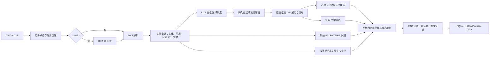
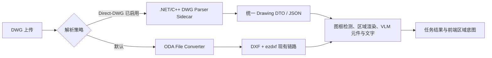

# 电气图纸元件识别：当前架构评审与改进路线

> **版本**：V2.2（补充 DWG 原生解析选型研究）  
> **日期**：2026-08-04  
> **目标**：从 DWG/DXF 电气图纸中稳定提取**元件、文字、CAD 位置和可追溯证据**，并在既有前端正确叠加展示结果。

---

## 1. 结论

当前项目已具备从文件接入到前端展示的可运行骨架：DWG 转 DXF、DXF 审计、规范 `INSERT` 元件识别、原生文字提取、DXF 图框分区、高 DPI 底图渲染、按图框执行的 VLM/OBB 元件识别、按图框执行的 VLM 文字提取、异步任务和前端结果接口均已存在。

但它尚不是可验证的“电气图纸识别能力”。决定目标能否达成的关键缺口有四项：

1. **无 `INSERT` 的打散符号没有可靠主路径。** 当前只能依赖尚未完成真实验证的 VLM/OBB；视觉不可用时会得到 0 个元件。
2. **中文文字恢复链路仍不完整。** 现已可按图框用 VLM 提取文字并保存来源、置信度和位置；但块内文字、`ATTRIB` 独立输出、轮廓化文字和 OCR 尚未形成统一文字池。
3. **CAD 坐标到 PNG/前端的真实投影仍未完全固化。** 当前区域框按图框 CAD 范围映射到区域 PNG；但尚未持久化渲染器实际边距、裁剪和仿射矩阵，复杂图纸不能保证像素级贴合。
4. **没有真实图纸真值集和评测闭环。** 现有回归测试主要证明流程连通，不能证明 15 类元件在真实图纸上的召回率、准确率或位置误差。

因此，近期投入应优先建立“可测量、可校准的混合识别链路”，而不是扩展 BOM、拓扑、人工审核、用户体系或生产化能力。

---

## 2. 当前技术架构



### 2.1 当前代码边界

| 模块 | 责任 | 当前结论 |
|---|---|---|
| `ingest/` | 文件校验和 DWG 转 DXF | ODA 转换已接入；转换产物、日志、文字保真检查未持久化。 |
| `cad/` | DXF 审计、顶层实体与 Block 解析、坐标模型 | 可解析顶层 `TEXT/MTEXT` 和 `INSERT`；未递归抽取块内文字。 |
| `rendering/` | DXF 渲染、区域检测、切片 | 已支持系统中文字体映射、图框高清渲染；优先识别闭合矩形，另有分段多段线组框回退，但复杂图框仍需验证。 |
| `recognition/` | 元件目录、VLM/OBB/OCR 适配器 | 15 类目录；VLM 元件和 VLM 文字均按图框切片执行；OCR 仍仅占位，OBB 未配置可验证权重。 |
| `fusion/` | 属性/文字关联、候选组装 | 原生文字与元件已按图框分桶后关联；跨证据冲突融合和多候选全局优化不足。 |
| `runtime/`、`api.py` | 任务、事件、前端兼容接口 | 已持久化每图框底图、CAD 范围和图框索引；真实渲染变换未完整暴露。 |
| `evaluation/`、`tests/` | 冒烟与回归验证 | 已覆盖合成样本和接口流程；缺真实图纸真值评测。 |

---

## 3. 已实现能力清单

以下能力已有代码和回归覆盖；“已实现”只表示功能存在，不等同于识别准确率已通过真实样本验证。

### 3.1 文件、任务与接口

- DWG/DXF 扩展名和大小校验，上传后创建 SQLite 持久化任务。
- 异步任务状态、阶段事件、轮询接口和 SSE 调试流。
- DWG 经 ODA File Converter 转换为 DXF；未配置转换器时返回明确失败。
- 前端上传、任务查询、底图、元件、文字和空表格接口已连通。
- 后端读取实际 PNG 尺寸；前端按原始比例缩放底图，不再固定拉伸为 `1200 × 900`。
- 识别任务会将检测到的 DXF 主图框分别渲染为高 DPI PNG，并持久化为区域底图；前端图纸页选择器会切换对应图框底图。
- 元件和文字结果保存 `frame_index`；前端优先使用该持久化图框归属筛选结果，并为历史任务保留按 CAD 坐标推断图框的兼容回退。

### 3.2 矢量解析与规则识别

- 审计模型空间实体类型、图层、未知 Block、顶层 `TEXT/MTEXT`。
- 基于 `INSERT`、Block 别名和 `ATTRIB` 的规范元件识别，并按图框分配结果。
- 15 个业务类别、英文稳定类型、中文名称、业务分类和参考素材映射。
- `ATTRIB` 优先、近邻原生文字和类别正则的位号/参数关联；近邻搜索限定在同一图框内。
- CAD 坐标的轴对齐缩放和 Y 轴翻转往返测试。

### 3.3 图像与视觉候选路径

- `ezdxf` + Matplotlib DXF 渲染。
- 配置式中文字体覆盖：默认尝试本机 `simhei.ttf`；它只影响仍是文字实体的内容，不能恢复已变为线段、填充或轮廓的中文。
- 优先检测大型封闭、轴对齐四点 `LWPOLYLINE` 图框；对由连续水平/垂直 `LWPOLYLINE` 边段拼成的矩形提供回退检测。
- 每区域按 `DRAWING_VISION_DPI`（默认 450）渲染并以 `1536 px`、`192 px` 重叠切片；区域 PNG 和 CAD 范围作为任务结果持久化。
- OpenAI 兼容 VLM 适配器支持两种严格 JSON 输出：电气元件框和文字框；两者均按图框、按切片调用。元件识别仍支持可选 Ultralytics OBB 和 VLM 失败后的 OBB 回退。
- 区域内同类别 IoU 去重、文字切片重叠去重，以及元件/文字像素框回写到所属图框 CAD 范围。
- VLM 文字带 `source=vlm`、置信度、像素框和 `frame_index`；原生 DXF 文字带 `source=dxf`，前端文字列表会标识 VLM 来源。

### 3.4 当前已验证范围

- P0–P2 回归测试覆盖文件流程、规范 Block 小样本、渲染/切片、闭合图框与分段图框候选、VLM 元件/文字响应过滤与失败降级。
- `data/B电气图_主图框/` 保存了基于当前 DXF 检测规则渲染的主图框样例，作为人工检查图框裁剪和文字可读性的证据。
- 这不覆盖真实打散电气图、轮廓化中文、真实 VLM 服务或已训练 OBB 权重，不能据此宣称识别准确率。

### 3.5 图框分区识别实施合同（V2.1）

处理顺序固定如下，避免将一张含多个主图框的大 PNG 直接交给识别器：

1. 从转换后的 DXF 模型空间检测主图框；优先使用单一闭合矩形多段线，再尝试由水平、垂直多段线边段拼成的矩形。
2. 对每个图框生成 `index`、名称、`cad_extent=[min_x,min_y,max_x,max_y]`，并以该范围单独高 DPI 渲染 PNG。
3. 将区域 PNG 保存在任务渲染目录；任务 DTO 的 `baseImages` 返回图片 URL、像素尺寸和 CAD 范围，前端使用图纸页选择器切换底图。
4. 原生 `INSERT` 元件和 `TEXT/MTEXT` 先根据 CAD 中心点写入 `frame_index`；原生文字关联只在同一 `frame_index` 内执行。
5. VLM 元件检测和 VLM 文字提取均在每个图框的切片上分别执行。切片像素框先回写区域像素坐标，再通过图框 CAD 范围回写 CAD 坐标。
6. API 输出元件和文字时优先使用持久化的 `frame_index` 生成 `页N`；缺少该字段的历史结果才按 CAD 点落入范围推断。

VLM 文字响应合同如下。模型无法读取的文字必须省略，而非编造：

```json
{
  "texts": [
    {
      "content": "QF1",
      "bbox": [12, 34, 95, 60],
      "confidence": 0.91
    }
  ]
}
```

每条 VLM 文字以 `VLM_TEXT`、`source="vlm"`、`confidence`、`detection_bbox_px` 和 `frame_index` 保存。前端文字列表通过 `VLM` 标签与 `source="dxf"` 的原生文字区分。

> **当前限制**：分段图框回退仅适用于轴对齐、边端连续且能合成完整矩形的 `LWPOLYLINE`。对于非矩形、旋转、存在较大断口或使用其他实体类型的图框，仍可能无法拆分并退回整图区域；必须以真实 DXF 样本和持久化底图人工核验。

---

## 4. 尚未实现或未完成部分：按目标影响排序

排序依据是对“元件、文字、位置和证据可靠输出”的直接影响，而非实现难度。

| 优先级 | 缺口 | 对目标的影响 | 建议完成标准 |
|---|---|---|---|
| P0 | 无 `INSERT` 图纸的可靠元件识别 | 当前样本类型可能直接返回 0 个元件，是主目标的最大阻塞。 | 为真实打散图建立矢量候选或已训练视觉模型；在独立真值图上报告每类召回、精确率与定位误差。 |
| P0 | 真实渲染坐标变换与前端叠加校准 | 框可能与底图不一致，导致位置结果不可用或不可审计。 | 每次渲染持久化 CAD 范围、像素范围、裁剪、边距和仿射矩阵；以已知实体锚点自动验证。 |
| P0 | 文字恢复与统一文字池 | 已增加图框级 VLM 文字，但中文位号、参数和设备名称仍可能漏检或误读。 | 递归提取块内文字和 `ATTRIB`；评测 VLM 文字准确率；对原生文字稀缺区域引入 OCR；统一保存文本、框、来源和置信度。 |
| P0 | 最小真实图纸真值集与评测 | 没有客观指标，无法判断方案是否改善或选择 VLM/OBB。 | 按图纸来源划分训练/验证/测试；输出类别级 precision、recall、定位误差、文字准确率、耗时和成本。 |
| P1 | 证据模型贯通到 API 与前端 | `pending`、冲突、文字依据和视觉来源未完整展示，结果无法追溯。 | 元件 DTO 提供 `source`、`review_status`、候选框、关联文本、冲突原因、模型/切片证据。 |
| P1 | VLM 严格输出合同与失败分型 | 元件和文字已经使用 JSON 对象、类别/坐标/置信度过滤，但尚未版本化并记录全部拒绝原因。 | 对请求和响应采用版本化 JSON Schema；限制最大候选数；记录拒绝原因和模型版本。 |
| P1 | 分区鲁棒性与跨区域去重 | 已支持单实体图框和分段 `LWPOLYLINE` 矩形回退；复杂版面仍可能整图回退或跨图框重复。 | 支持 `LINE` 组合框、嵌套/旋转框、实体密度候选；按 CAD 坐标跨区域去重。 |
| P1 | DWG 转换可追溯与中文保真检查 | 转换后中文是否语义丢失无法定位，也难以复现。 | 保留 DXF、转换器版本、标准输出/错误、输入输出哈希；统计转换前后文本实体与字体依赖。 |
| P2 | 文字关联的方向、引线与竞争约束 | 仅“最近文字”会把相邻设备的位号错配。 | 联合距离、方向、引线、类别正则和全局一对一匹配；歧义输出 `pending`。 |
| P2 | 真实 OBB 训练与部署 | 当前 OBB 只是接口；没有自定义权重即没有识别能力。 | 用真实/合成切片做四点 OBB 标注，训练并在独立图纸上评测；再决定是否部署。 |
| P3 | BOM、标题栏、拓扑、Netlist、人工审核、用户权限 | 与本轮元件/文字/位置目标无直接关系。 | 仅在 P0–P2 指标稳定后单独立项。 |

### 4.1 必须明确的运行时降级

当图纸 `INSERT=0` 且 VLM 未启用、VLM 请求失败且 OBB 未配置有效权重时，服务不应仅返回“成功、0 个元件”。应在结果中明确标记：**当前图纸需要视觉/矢量打散符号识别能力，机器未获得可用识别器**。这能避免把“未识别”误解成“图纸没有元件”。

---

## 5. 推荐的改进技术方案

### 5.1 首选路线：矢量优先、视觉补盲、证据统一

不建议把所有 DXF 直接栅格化后交给 VLM。对于 CAD 图纸，更稳健的路线是：

1. **保留和扩展原生矢量信息。** 解析 `INSERT`、`ATTRIB`、`TEXT/MTEXT`、块定义、图元几何、图层和文字样式。
2. **为打散符号建立矢量候选生成器。** 从 `LINE`、`LWPOLYLINE`、`ARC`、`CIRCLE`、`HATCH` 构造局部连通子图，以符号局部范围、端点、拓扑和几何描述子生成候选；再用参考符号、VLM 或分类器判类。
3. **仅对候选区域做高分辨率视觉。** 视觉模型验证或补充矢量候选，而非扫描整图的所有内容；降低成本并保留 CAD 坐标可解释性。
4. **统一融合模型。** 每条元件和文字证据带来源、范围、置信度、转换链、模型版本；融合后明确 `approved`、`pending` 或 `unavailable`。

该路线能直接改善当前“图元已打散，Block 识别为空”的核心问题，也能减少 VLM 在密集整图中定位不稳定的问题。

### 5.2 坐标服务：从比例估算升级为可审计投影

为每次整图和区域渲染生成不可变 `RenderTransform`：

```text
CAD extent + 视口范围 + figure 尺寸 + DPI + 轴方向 + 裁剪矩形 + 边距
                    ↓
         CAD ↔ region pixel ↔ tile pixel ↔ frontend pixel
```

- 渲染函数应返回 PNG 路径和该变换对象，而不是只返回文件路径。
- 切片要记录其左上像素偏移；检测框先从 tile 回写到 region，再回写到 CAD。
- 前端归一化框应由 CAD 框经同一变换得到，而非依据本批结果点的最小/最大值。
- 每张图至少选择四个已知 CAD 锚点，自动验证其像素误差；超过阈值时将视觉结果降为 `pending`。

`ezdxf` 的 Drawing Add-on 采用 Frontend/Backend 两段式渲染，并提供记录绘制结果与布局坐标变换的能力；其官方文档也明确提示不同字体会造成字形与位置差异。因此，坐标变换必须由渲染链路实际产出，而不能仅由 DXF 外接范围推导。

### 5.3 中文文字：原生优先、选择性 OCR 补偿

建议建立一个统一的 `TextEvidence` 结构：

```json
{
  "text": "QF1",
  "cad_polygon": [[0, 0], [1, 0], [1, 1], [0, 1]],
  "source": "attrib|native_text|block_text|vlm|ocr",
  "confidence": 0.99,
  "style": "simhei.ttf",
  "region": "region_01",
  "frame_index": 0
}
```

处理顺序：

1. 顶层 `TEXT/MTEXT`；
2. `INSERT` 的 `ATTRIB` 作为独立文字；
3. 递归遍历 Block 定义，应用插入的平移、缩放、旋转；
4. 对每个区域的高 DPI 切片执行 VLM 文字提取，保存文字框、来源与置信度；
5. 对“原生文字数量异常少”或“转换后出现大量轮廓文字”的区域，执行 OCR；
6. 以 CAD 坐标、区域、方向和置信度合并重复文字。

OCR 应只处理候选区域或文字稀缺区域，避免对整张图做高成本、低收益 OCR。现代 OCR 服务可返回词/行的多边形和置信度，可直接进入上述统一模型；对中文电气图还应通过字典、位号正则和字符集约束做后校验。

字体映射仍应保留，但只能解决“DXF 仍存为文本而本机缺少字体”的显示问题；DXF 对字体通常只保存文件名，环境缺失 SHX/TTF 时无法保证替代字体与原字形度量一致。

### 5.4 图纸区域识别：多策略候选，而非单一图框规则

按可靠性依次组合：

1. DXF 中的闭合多段线或矩形图框；
2. `LINE`/`LWPOLYLINE` 的共线端点合并，组成矩形或近矩形；
3. 利用实体空间密度与留白分隔形成候选区域；
4. 对低分辨率预览图做边缘检测和 Hough 直线检测，作为矢量图框缺失时的后备；
5. 使用标题栏、文字密度和尺寸规则对区域打分，过滤表格、注释和边框嵌套。

每个区域都保存 CAD 范围、选择理由、渲染参数、切片和候选数。区域之间重叠时，在 CAD 坐标系执行类别感知 NMS/融合，避免重复元件。

### 5.5 视觉模型：VLM 用于冷启动，定制 OBB 用于稳定定位

- **VLM**：适合快速验证类别、解释模糊符号和为候选打标签；必须使用严格结构化响应、固定类别表、图像尺寸和坐标格式校验。
- **定制 OBB**：适合符号任意方向和密集布局下的稳定定位，但需要自有标注数据。OBB 标签应保存四个角点；预测框可保留旋转角和四点坐标，再投影到 CAD。
- **不建议直接使用通用 OBB 预训练权重作为电气符号识别结论。** 其预训练类别与电气图符号并不匹配，只适合作为模型初始化或工程验证。
- **主动学习闭环**：从 `pending`、VLM/矢量冲突、低置信度和高价值图纸中采样标注，而非盲目扩大数据量。

---

## 6. 最小可行实施计划

### 阶段 A：先建立可测量底座（P0）

1. 实现并持久化 `RenderTransform`，改造前端框投影。
2. 增加 `ATTRIB` 独立输出、块内文字递归提取和统一 `TextEvidence`。
3. 设计真实图纸标注格式，至少覆盖规范 Block、打散符号、中文文字、旋转/密集区域。
4. 实现评测：元件 precision/recall、类别准确率、文字准确率、CAD 中心误差、框 IoU、分阶段耗时与每图成本。
5. 对视觉不可用的无 Block 图纸返回明确 `unavailable` 限制，而非静默 0 结果。

**阶段完成条件**：可复现运行；坐标误差有量化结果；每个输出带来源；能区分“未检出”与“识别器不可用”。

### 阶段 B：解决真实打散图识别（P1）

1. 实现矢量局部候选生成和符号几何特征。
2. 扩展区域检测并增加 CAD 跨区域去重。
3. 接入选择性 OCR，完成文字与元件的方向/引线/竞争关联。
4. 让 VLM 使用版本化 Schema，并归档提示词、模型、图像和拒绝原因。

**阶段完成条件**：真实打散图不再只能依赖整图 VLM；在验证集上能给出基线指标和失败样本。

### 阶段 C：选择并训练稳定视觉基线（P2）

1. 基于阶段 B 的区域/切片和标注导出 OBB 数据集。
2. 训练并评测定制 OBB，与 VLM 在同一独立测试集比较。
3. 采用按类别和定位误差的融合策略，而不是仅以单一置信度阈值决策。

**阶段完成条件**：选择 VLM、OBB 或融合的依据是独立评测结果，而不是主观观感。

---

## 7. 不纳入当前目标的内容

以下内容对“元件、文字、位置、证据”首要目标没有直接贡献，应从当前技术路线中移除，待识别指标稳定后再评估：

- BOM/标题栏结构化与一致性校验；
- 导线追踪、端子连接、跨页关系、拓扑、Netlist 和图数据库；
- 人工审核队列、协作、用户、权限、通知、Webhook；
- 分布式队列、对象存储、多租户、服务级别承诺；
- 未经真实数据集评测的准确率承诺。

---

## 8. DWG 原生解析选型研究（2026-08-04）

### 8.1 结论

**可以直接解析 DWG，不必先转为 DXF；但当前项目不建议把 AutoCAD 客户端自动化作为后端主路径。**

对于本项目“从 DWG 中稳定读取实体、文字、图块、扩展数据和坐标，再按图框分区识别”的目标，建议按下列优先级选择：

1. **生产候选：ODA Drawings SDK。** 以 C++/.NET 适配层或独立解析服务直接读取 DWG，再向 Python 后端输出稳定的 JSON/DXF 中间结果。它最符合跨版本 DWG、非 AutoCAD 进程运行、批处理和部署可控的需求。
2. **最高保真候选：Autodesk RealDWG。** 若预算、Windows 运行环境和商业授权可接受，采用 .NET/C++ 侧车服务直接读取 DWG；它由 Autodesk 提供，对 AutoCAD DWG 版本和专有对象的兼容风险最低。
3. **保留现有 ODA File Converter → `ezdxf` 作为默认实现。** 对当前 Python 架构改动最小，且 `ezdxf` 官方明确定位为 DXF 接口而非 DWG 转换器；转换仍适合快速迭代与作为 Direct-DWG 解析的对照基线。
4. **Aspose.CAD 仅作为评测候选。** 它可在没有 CAD 软件依赖时处理 DWG 并导出 PNG/PDF，且提供 .NET、Java 和 Python/.NET 路线；但在引入前必须用本项目真实 DWG 验证其是否能暴露所需的低层实体、图块、属性和文字语义，而不能仅以“可渲染”为依据。
5. **LibreDWG 不作为闭源/商业后端的嵌入式主方案。** 它是可读写 DWG 的 C 库，提供 SWIG/Python 等绑定与命令行转换工具，但项目采用 GPL-3.0-or-later；直接链接或分发前必须完成许可证合规评估。其维护者也说明 R2010+ 部分高级对象可能被跳过，因此不能把它作为高保真保证。

### 8.2 方案比较

| 方案 | 是否直接读取 DWG | 运行/语言边界 | 适合本项目的能力 | 主要约束 | 结论 |
|---|---|---|---|---|---|
| **Autodesk RealDWG** | 是 | Windows；C++ / .NET | AutoCAD 原生 DWG/DXF 读写、数据库式实体访问、图块/文字/对象属性保真 | 商业许可；Windows 与 .NET/C++ 适配服务；需要处理 SDK 部署 | 高保真生产备选，优先用于客户文件版本复杂或存在 Autodesk 专有对象的场景。 |
| **ODA Drawings SDK** | 是 | C++ / .NET 等 SDK 支持环境；可包装为服务 | DWG/DGN 原生数据访问、编辑、保存、渲染与转换；适合批处理解析 | 商业会员/许可；需实现项目专用 DTO 映射与回归集 | **推荐的 Direct-DWG 首选评测方案**。 |
| **AutoCAD ObjectARX / .NET / COM 自动化** | 是（由已安装 AutoCAD 打开） | Windows、AutoCAD 进程内或自动化 | 可调用完整 AutoCAD 数据库和对象模型 | 需要安装/维护 AutoCAD；桌面软件自动化不适合并发无头服务，许可与会话管理复杂 | 只用于人工复核工具、离线比对或插件，不作为 API 服务主链路。 |
| **ODA File Converter + `ezdxf`** | 转换后读取 DXF | 当前 Python 服务 | 成熟、改动小、已接入图框检测/渲染/识别流程 | 转换可能改变文字、字体、代理对象或应用数据；需要 ODA 可执行文件 | 保持当前默认路径，并作为 Direct-DWG 的回归对照。 |
| **Aspose.CAD** | 是 | .NET / Java / Python/.NET | 无 CAD 软件依赖的加载、转换与渲染 | 商业产品；官方产品页主要强调格式处理/转换，需验证低层 DWG 语义覆盖 | 可做 PoC，不能在未验收实体模型前替代解析主链路。 |
| **LibreDWG** | 是 | C、SWIG/Python 等 | 开源读取、搜索文字、导出 DXF/JSON 等 | GPL-3.0-or-later；高级 R2010+ 对象覆盖限制；需自行承担兼容验证 | 适合隔离式研究或 GPL 合规项目，不建议当前产品直接嵌入。 |

### 8.3 对当前架构的建议落地方式

不要让 Python 通过 `ctypes` 直接绑定大型商业 C++ DWG SDK。推荐采用**解析侧车（sidecar）**，将供应商 SDK、许可证、异常隔离和 Windows 依赖收敛在独立进程中：



建议的 Direct-DWG 侧车返回最小、供应商无关的 `Drawing DTO`：

```json
{
  "source_format": "dwg",
  "sdk": "oda|realdwg",
  "sdk_version": "...",
  "drawing_version": "...",
  "modelspace_extents": [0, 0, 100, 50],
  "entities": [],
  "blocks": [],
  "texts": [],
  "attributes": [],
  "layers": [],
  "warnings": []
}
```

DTO 至少应保留：实体句柄、实体类型、图层、几何、`INSERT` 的变换和 `ATTRIB`、`TEXT/MTEXT` 内容与样式、块定义、XREF/代理对象状态、模型空间范围、DWG 版本和解析警告。业务层只能依赖该 DTO，不能依赖 ODA 或 RealDWG 的对象类型；这样才能保留 DXF 路径作为可替换后备。

### 8.4 POC 与验收标准

在替换默认路径前，分别使用 **ODA Drawings SDK** 和（如有商业许可）**RealDWG** 建立同一份 Windows 测试服务，对 `data/B电气图.dwg` 及至少 10 份真实 DWG 执行对比：

1. DWG 可打开率、耗时、内存峰值和异常类型；
2. 模型空间范围、图层数、实体类型计数、图块数、`ATTRIB` 数和文字数与 AutoCAD 人工检查的差异；
3. 图框数量与范围是否与 AutoCAD 一致，区域 PNG 是否能保留轮廓化文字和图元；
4. 在每个主图框内，元件和文字的 `frame_index`、CAD 坐标、前端框位置是否稳定；
5. 代理对象、XREF、动态块、SHX/TTF 字体、中文文字和 R2018+ DWG 的降级行为；
6. 与现有“ODA File Converter → DXF → `ezdxf`”链路逐项对比，并保留输入哈希、SDK 版本、警告和输出摘要。

只有当 Direct-DWG 路径在真实样本上证明**文字/图块/图框保真更好且可接受其许可、部署和成本**时，才将其提升为默认路径；否则继续使用现有转换链路。

### 8.5 当前实现的运行时开关

后端已提供以下环境变量选择 DWG 入口：

```text
# false 或未设置：使用现有 ODA File Converter → DXF → ezdxf 路径
DRAWING_USE_REALDWG=false

# true：使用自建的、由 RealDWG 驱动的侧车直接打开 DWG，再输出供 Python 现有链路消费的 DXF
DRAWING_USE_REALDWG=true
REALDWG_PARSER_COMMAND=C:\\path\\to\\YourRealDwgSidecar.exe
```

当 `DRAWING_USE_REALDWG=true` 时，所有 `.dwg` 上传都会跳过 `ODA_FILE_CONVERTER`，调用 `REALDWG_PARSER_COMMAND`。后端会将**输入 DWG 路径**和**临时输出 DXF 路径**作为该命令最后两个参数传入：

```text
YourRealDwgSidecar.exe <input.dwg> <output.dxf>
```

侧车必须在退出码为 `0` 时写出输出 DXF；否则任务将失败并返回 `RealDWG 解析失败` 的可读错误。该设计确保一旦显式选择 RealDWG，服务不会静默回退到 ODA，从而避免混淆两条链路的保真和评测结果。任务能力接口会返回当前 `dwg_parser` 为 `realdwg_sidecar` 或 `oda_file_converter`。

> **澄清**：`RealDwgParser.exe` 是此前文档中用于说明调用合同的示例名称，不是安装 AutoCAD 2020 后会出现的 Autodesk 官方程序。AutoCAD 产品本身不随附 RealDWG SDK 或可直接调用的无头解析器。此仓库同样不包含该二进制文件；需取得单独的 RealDWG 商业许可/SDK，并用 C++ 或 .NET 实现、编译和部署自定义侧车（其文件名可自行确定）。

> 此仓库只实现了 Python 到 RealDWG 侧车的选择、进程隔离和输入输出合同；RealDWG 的 DLL、商业许可和 C++/.NET 侧车二进制文件必须由具备 Autodesk 授权的 Windows 部署环境提供。

### 8.6 研究依据

- [Autodesk RealDWG API](https://aps.autodesk.com/developer/overview/realdwg-oem)：Autodesk 说明 RealDWG 为 C++/.NET 提供 DWG/DXF 读写，支持 AutoCAD R14 以来的读写兼容；当前页面列出 Windows 11、Visual Studio/.NET 的系统要求，并说明其是 ObjectARX 的子集。
- [Autodesk AutoCAD 2025 Developer and ObjectARX](https://help.autodesk.com/view/OARX/2025/ENU/)：官方开发文档列出 ObjectARX、Managed .NET、ActiveX/VBA 等 AutoCAD 应用程序 API，适合插件和桌面自动化，不等同于独立无头解析 SDK。
- [ODA Drawings SDK](https://www.opendesign.com/products/drawings)：ODA 宣称可访问 DWG/DGN 数据（含 xdata），支持原生格式读写、编辑、保存、渲染和转换，并列出 AutoCAD R12 至 2025 的 DWG 支持范围。
- [ezdxf Introduction](https://ezdxf.readthedocs.io/en/stable/introduction.html)：官方明确 `ezdxf` 是 DXF 接口，不能进行 DWG 转换，并建议使用 ODA File Converter 进行 DWG/DXF 转换。
- [Aspose.CAD](https://products.aspose.com/cad/)：产品页声明可在不安装 CAD 软件的情况下处理 DWG/DXF 等格式并导出 PDF、PNG 等，提供 .NET、Java、JavaScript 和 Python/.NET API。
- [LibreDWG](https://github.com/LibreDWG/libredwg)：项目说明其为 GPL-3.0-or-later 的 C DWG 读写库，读取器覆盖各 DWG 版本但部分高级 R2010+ 对象会跳过，且提供 Python/SWIG 绑定和 DWG→DXF/JSON 工具。

---

## 9. 技术调研依据

本轮建议结合代码现状和下列官方资料形成：

- [ezdxf Drawing / Export Add-on](https://ezdxf.readthedocs.io/en/stable/addons/drawing.html)：渲染由 Frontend/Backend 两阶段组成，支持记录绘制结果、布局与坐标变换；文档也说明字体差异会影响文字呈现。
- [ezdxf Font Resources](https://ezdxf.readthedocs.io/en/stable/concepts/fonts.html)：DXF 通常只保存字体文件名，缺少源 SHX/TTF 时替代字体不保证字形度量一致。
- [Microsoft Azure Vision OCR](https://learn.microsoft.com/en-us/azure/ai-services/computer-vision/concept-ocr)：OCR 结果可提供行、词、多边形和置信度，适合作为原生 DXF 文字的补充证据，而不是替代。
- [PaddleOCR Text Recognition](https://www.paddleocr.ai/latest/en/version3.x/module_usage/text_recognition.html)：当前本地 OCR 路线可返回识别文本和置信度，并提供简体中文等多语言模型；适合在受控区域内作为云端 OCR 的可替换实现。
- [Ultralytics Oriented Bounding Boxes](https://docs.ultralytics.com/tasks/obb/)：OBB 使用四点标注/旋转框输出，适用于任意方向对象；电气符号仍需要自有类别数据训练和独立验证。
- [OpenCV Hough Line Transform](https://docs.opencv.org/4.x/d9/db0/tutorial_hough_lines.html)：可作为图框缺失时的低分辨率线段检测后备，不应取代 DXF 原生几何解析。

> 调研结论：没有单个通用 VLM、OCR 或 OBB 模型能替代 CAD 原生解析、真实坐标校准和领域真值评测。最具性价比的改进是将它们放进可验证的混合证据链中。
