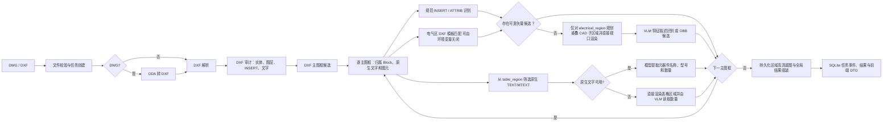
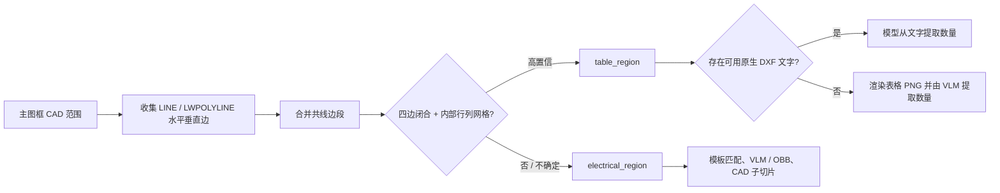
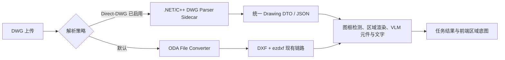

# 电气图纸元件识别：当前架构评审与改进路线

> **版本**：V2.6（可编辑语义分区、表格双路径提取、SSE 增量结果与 VLM 节流）  
> **日期**：2026-08-08  
> **目标**：从 DWG/DXF 电气图纸中稳定提取**元件、文字、CAD 位置和可追溯证据**，并在既有前端正确叠加展示结果。

---

## 1. 结论

当前项目已具备从文件接入到前端展示的可运行骨架：DWG 转 DXF、DXF 审计、规范 `INSERT` 元件识别、可开关的电气区 DXF 矢量模板匹配、原生文字提取、主图框内电气区/数量表分区、高 DPI 区域渲染、按电气区执行的特征描述 VLM/OBB 兜底识别，以及数量表的“原生 DXF 文字优先、表格图像 VLM 兜底”双路径提取。区域图像和 CAD 范围会持久化；前端可显示、编辑区域并重新提取，识别过程通过 SSE 增量推送图框元件、语义区域和表格数量结果。

但它尚不是可验证的“电气图纸识别能力”。决定目标能否达成的关键缺口有五项：

1. **无 `INSERT` 的打散符号仍没有经过真实数据验证的可靠主路径。** 已提供显式注册的 DXF 模板矢量匹配，并在每个主图框内优先执行；模板未配置、几何表达不一致或低分时仍依赖尚未完成真实验证的 VLM/OBB。
2. **文字和表格语义恢复仍不完整。** 当前保留顶层原生 `TEXT/MTEXT`；表格优先从这些文字提取数量，原生文字缺失或不可用时改从已渲染表格图像提取。块内文字、`ATTRIB` 独立文字、轮廓化文字、单元格结构恢复和 OCR 尚未形成统一文字池。
3. **CAD 坐标到 PNG/前端的真实投影仍未完全固化。** 当前区域框按图框 CAD 范围映射到区域 PNG；但尚未持久化渲染器实际边距、裁剪和仿射矩阵，复杂图纸不能保证像素级贴合。
4. **没有真实图纸真值集和评测闭环。** 现有回归测试主要证明流程连通，不能证明 15 类元件在真实图纸上的召回率、准确率或位置误差。
5. **手工区域重提取仍是同步 HTTP 生命周期。** 当前已把阻塞渲染和 VLM 调用移出 FastAPI 事件循环，并设置长客户端超时；但一个请求仍可能持续数分钟，尚未改造成独立重提取任务、可取消队列和完成事件。

因此，近期投入应优先建立“可测量、可校准的混合识别链路”，而不是扩展 BOM、拓扑、人工审核、用户体系或生产化能力。

---

## 2. 当前技术架构



### 2.1 当前代码边界

| 模块 | 责任 | 当前结论 |
|---|---|---|
| `ingest/` | 文件校验和 DWG 转 DXF | ODA 转换已接入；转换产物、日志、文字保真检查未持久化。 |
| `cad/` | DXF 审计、顶层实体与 Block 解析、坐标模型 | 可解析顶层 `TEXT/MTEXT` 和 `INSERT`；未递归抽取块内文字。 |
| `rendering/` | DXF 渲染、区域检测、CAD 子区域规划 | 已支持系统中文字体映射、图框高清渲染和重叠 CAD 子区域直接视口渲染；优先识别闭合矩形，另有分段多段线组框回退，但复杂图框仍需验证。 |
| `recognition/` | 元件目录、模板、VLM/OBB 适配器 | 15 类目录；分类运行时 DXF 模板支持在电气区内矢量匹配，可由 `DRAWING_TEMPLATE_MATCHING_ENABLED` 关闭；无可靠 Block/模板候选的图框才调用 VLM；VLM 仅使用特征描述与电气切片，不使用参考小图；OBB 未配置可验证权重。 |
| `fusion/` | 结果组装 | 原生文字不再和元器件做最近邻关联；确认表格区由原生文字或表格图像 VLM 形成独立数量清单。跨证据冲突融合和多候选全局优化不足。 |
| `runtime/`、`api.py` | 任务、事件、前端兼容接口 | 任务事件持久化结构化当前工作并通过 SSE 增量推送；已持久化每图框底图、CAD 范围、语义区域及区域 PNG；区域重提取会在工作线程执行同步渲染/VLM 调用，真实渲染变换和异步重提取任务仍未完整暴露。 |
| `evaluation/`、`tests/` | 冒烟与回归验证 | 已覆盖合成样本和接口流程；缺真实图纸真值评测。 |

---

## 3. 已实现能力清单

以下能力已有代码和回归覆盖；“已实现”只表示功能存在，不等同于识别准确率已通过真实样本验证。

### 3.1 文件、任务与接口

- DWG/DXF 扩展名和大小校验，上传后创建 SQLite 持久化任务。
- 异步任务状态、阶段事件和 SSE 增量流；上传页通过 `EventSource` 接收进度，不再轮询。
- DWG 经 ODA File Converter 转换为 DXF；未配置转换器时返回明确失败。
- 前端上传、任务查询、底图、元件、文字、表格数量和语义区域接口已连通；表格接口返回可复核结果，来源明确标记为 `native_dxf_text` 或 `table_region_vlm_image`。
- 后端读取实际 PNG 尺寸；前端按原始比例缩放底图，不再固定拉伸为 `1200 × 900`。
- 识别任务会将检测到的 DXF 主图框分别渲染为高 DPI PNG，并持久化为区域底图；前端图纸页选择器会切换对应图框底图。
- 元件和文字结果保存 `frame_index`；前端优先使用该持久化图框归属筛选结果，并为历史任务保留按 CAD 坐标推断图框的兼容回退。
- 每个主图框的 `electrical_region`、`table_region` 都保存 CAD 范围、判定证据和高 DPI PNG 相对路径；前端可独立显示/隐藏两类覆盖层，拖拽或缩放后发起对应的 VLM 重提取。

### 3.2 矢量解析与规则识别

- 审计模型空间实体类型、图层、未知 Block、顶层 `TEXT/MTEXT`。
- 基于 `INSERT`、Block 别名和 `ATTRIB` 的规范元件识别，并按图框分配结果。
- 图框内模板匹配：自动加载 `backend/data/runtime/reference-icons/<component_type>/**/*.dxf` 中按目录分类的模板，`DRAWING_TEMPLATE_MANIFEST` 可补充外部模板；`DRAWING_TEMPLATE_MATCHING_ENABLED=false` 可完全跳过该阶段。可靠模板结果以 `source="template"` 保存。
- 15 个业务类别、英文稳定类型、中文名称、业务分类和参考素材映射。
- 保留所有顶层原生 `TEXT/MTEXT` 及其 CAD 坐标；当前不再将文字按最近邻自动关联至元器件。
- 对确认的 `table_region`，先按 CAD 范围筛选并按从上到下、从左到右排序原生文字，由模型提取元器件名称、型号/类别、数量、单位和证据；若该区域没有原生文字，则直接将持久化的表格 PNG 交给 VLM。两条路径均作为独立 `drawing.tables` 输出，且必须人工复核。
- CAD 坐标的轴对齐缩放和 Y 轴翻转往返测试。

### 3.3 图像与视觉候选路径

- `ezdxf` + Matplotlib DXF 渲染。
- 配置式中文字体覆盖：默认尝试本机 `simhei.ttf`；它只影响仍是文字实体的内容，不能恢复已变为线段、填充或轮廓的中文。
- 优先检测大型封闭、轴对齐四点 `LWPOLYLINE` 图框；对由连续水平/垂直 `LWPOLYLINE` 边段拼成的矩形提供回退检测。
- 对需要视觉兜底的主图框，按与旧渲染密度等价的比例规划最长边 `1536 px`、重叠 `192 px` 的 CAD 子区域；每个子区域以 DXF 视口直接渲染，不从主图框 PNG 裁切。区域底图和 CAD 范围作为任务结果持久化。
- OpenAI 兼容 VLM 适配器仅请求电气区 CAD 切片的元器件框 JSON；请求中包含允许类别和人工维护的特征描述，不附带 Excel 或其他参考小图。元件识别仍支持可选 Ultralytics OBB 和 VLM 失败后的 OBB 回退。
- 区域内同类别 CAD 框 IoU 去重；每个视觉元件框依据其直接渲染切片的实际像素尺寸和 CAD 范围回写 CAD 坐标。`detection_bbox_px` 仅表示当前切片局部坐标。
- `backend/data/component-evidence.json` 覆盖 15 个目录类别的图形线索、可选位号模式与易混淆告警。VLM 元件提示自动加载该库；位号（例如 `QF1`/`QF2`）只能作为相邻图形的辅助证据，不能单独产生检测，且检测框必须只覆盖图形本体而不含文字。

#### 任务可观测性与关键日志

- `recognition_runs` 与 `recognition_events` 会持久化阶段、进度、用户说明和结构化 `work_json`；SSE 仅增量推送新事件，上传页不再固定间隔轮询。
- 控制台和 `backend/logs/drawing-recognition.log` 会记录图纸转换、原生解析统计、图框开始/结束、模板清单与逐模板原始/通过匹配数、VLM 图框与切片开始/结束、检测数量、请求耗时和 OBB 回退。
- VLM 日志只记录模型标识、切片名、特征描述数量、超时、结果数量和安全失败类别；不得记录密钥、服务端点、完整提示词或图像内容。
- `DRAWING_VLM_REQUEST_INTERVAL_SECONDS` 以**单个后端进程**为范围约束所有主链路 VLM HTTP 请求（元件、文字、原生表格文字和表格图像）。`0` 表示不等待；正数 $N$ 保证相邻请求开始时间至少相隔 $N$ 秒。该限制不跨多个进程或多个部署副本生效。

#### 元器件判断依据库维护准则

依据库按“**必需图形结构 → 可选位号/上下文 → 排除条件**”维护。位号规则仅用于核验相邻、清晰可读的文字，不能作为从文字直接生成元件框的依据。

| 类别 | 主图形线索 | 可辅助的位号/上下文 | 必须排除的易混淆项 |
|---|---|---|---|
| 断路器 | 斜触点/开断触点及叉号或灭弧标记 | `QF`、`CB` | 隔离开关、熔断器；不能仅凭 `QF`。 |
| 电流互感器 | 单根一次导线穿过环形/圆形符号 | `TA`、`CT`、电流测量回路 | 电流表、零序 CT、电压互感器。 |
| 电压互感器 | 一次与二次绕组，母线并接取压 | `TV`、`PT` | 电压表、主变压器。 |
| 零序电流互感器 | 同一环包围多根相线 | `TA0`、`ZCT`、零序保护 | 单相电流互感器。 |
| 避雷器 | 从主回路引下并接地的避雷器本体 | `YH`、`SA` | 接地开关、普通接地。 |
| 熔断器 | 串联熔断器专用符号 | `FU` | 端子、仪表框、断路器。 |
| 接地开关 | 可动触点明确接向地符号 | `ES`、`QES` | 普通隔离开关（如 `QS`）、断路器。 |
| 带电显示器 | 三相采样连接与指示单元组合 | `VPIS`、带电显示 | 指示灯、避雷器、普通仪表。 |
| 电流表/电压表 | 圆圈内完整 `A` / `V` | `PA` / `PV` | 单位文字 `A`、`V`、`kV`，或裸露字母。 |
| 热继电器/接触器 | 热元件或接触器线圈与成组触点关系 | `FR` / `KM` | 普通继电器、单个辅助触点。 |
| 单个电容器 | 两片分离且平行的极板 | `C`、`CAP` | 断开触点、平行导线、电容器组。 |
| 三相并联电容器组 | 三相电容单元成组、并接补偿支路 | `BC`、无功补偿 | 单个电容器、普通三相负载。 |
| 变压器 | 双绕组/双圆结构及一次、二次主回路 | `T`、`TR`、变比、接线组别 | CT、PT、圆形仪表；`T` 位号本身不充分。 |

新增或修改规则时应优先使用经人工确认的真实图纸变体；每项至少保留一个正例和一个易混淆反例，并通过独立图纸评测其误检变化。

### 3.4 当前已验证范围

- P0–P2 回归测试覆盖文件流程、规范 Block 小样本、CAD 子区域直接视口渲染、闭合图框与分段图框候选、VLM 元件响应过滤与失败降级、表格区原生文字数量提取、原生文字缺失时的表格图像 VLM 回退和模板开关。
- `data/B电气图_主图框/` 保存了基于当前 DXF 检测规则渲染的主图框样例，作为人工检查图框裁剪和文字可读性的证据。
- 这不覆盖真实打散电气图、轮廓化中文、真实 VLM 服务或已训练 OBB 权重，不能据此宣称识别准确率。

### 3.5 主流程实施合同：电气区定位与表格双路径数量提取（V2.6）

处理顺序固定如下，避免将一张含多个主图框的大 PNG 直接交给识别器：

1. 从转换后的 DXF 模型空间检测主图框；优先使用单一闭合矩形多段线，再尝试由水平、垂直多段线边段拼成的矩形。
2. 对每个图框生成 `index`、名称、`cad_extent=[min_x,min_y,max_x,max_y]`；原生 DXF 解析在主图框循环前执行一次，随后按图框范围写入 Block 和 `TEXT/MTEXT` 的 `frame_index`。
3. 通过水平/垂直矢量网格检测，在每个主图框内产生至多一个 `electrical_region` 和一个 `table_region`；两者允许重叠。没有可信数量表时，仅产生覆盖整个图框的电气区。
4. 在电气区内优先保留规范 `INSERT`/`ATTRIB` 的确定性候选；若 `DRAWING_TEMPLATE_MATCHING_ENABLED=true`，再做分类 DXF 矢量模板匹配。模板与已知 Block 同类型且空间重叠时去重，优先保留 Block 证据。
5. 当前图框没有可靠 Block 或模板候选时，才按 `electrical_region` CAD 范围规划重叠子区域；每个子区域限制 DXF 视口后直接高 DPI 渲染。VLM 仅使用元器件特征描述、允许类别和当前切片进行检测；不发送参考小图。VLM 请求失败时，只有配置了可用 OBB 权重才降级到 OBB。
6. 视觉检测框使用切片 CAD 范围和实际像素尺寸回写全局 CAD 中心位置；同一电气区、同一类别且 CAD 框 IoU 达到阈值的重叠切片候选去重。`detection_bbox_px` 保留为对应切片的局部像素框。
7. 对 `table_region` 不进行电气图符定位。系统优先筛选其中原生 `TEXT/MTEXT`，按视觉阅读顺序发送给模型，输出元器件名称、型号/类别、数量、单位、置信度和文字证据至 `drawing.tables`；没有原生文字时，改为将该表格区域高 DPI PNG 交给 VLM 读取同一 JSON 合同。两种来源都必须带 `source`，必须人工核对，且不生成图符位置。
8. 将主图框 PNG 保存在任务渲染目录；任务 DTO 的 `baseImages` 返回图片 URL、像素尺寸和 CAD 范围。API 输出元件和原生文字时优先使用持久化 `frame_index` 生成 `页N`；历史结果才按 CAD 点落入范围推断。
9. SSE 事件推送 `phase`、`message` 和结构化 `currentWork`；除模板匹配、VLM 元器件切片、主图框底图和 `table_quantity_extraction` 阶段外，还会在每个主图框完成分区后推送 `frame_layout_regions`，在每张表提取完成后推送 `table_quantities`，使前端无需等待全图完成。

> **当前限制**：分段图框回退仅适用于轴对齐、边端连续且能合成完整矩形的 `LWPOLYLINE`。对于非矩形、旋转、存在较大断口或使用其他实体类型的图框，仍可能无法拆分并退回整图区域；必须以真实 DXF 样本和持久化底图人工核验。

### 3.6 主图框内电气区 / 表格区语义拆分（2026-08-08）

主图框仍可能过大，且表格网格、标题栏文字进入元器件识别会增加 VLM/OBB 调用量与误报。因此在每个主图框内新增第二级、**矢量优先**的版面分区。该级别不替代主图框检测，也不以通用图像分割模型作为主判据。

对于 `B电气图.dxf` 的 `region_01`，目标不是把共享外框的整块区域当作表格：**上方为一次电气图纸区，只有下方连续重复行组成的元器件数量说明表属于表格区**。两者即使共享左右边界或部分列线，也必须按横向网格带分开；上方单线图必须保留为 `electrical_region` 并参与元器件识别。



#### 3.6.1 表格判定合同

在当前主图框内，候选 `table_region` 必须同时满足：

1. 存在轴对齐的顶部、底部、左侧、右侧边；
2. 范围达到图框宽、高和面积的最小比例，且不超过图框面积的 $75\%$；
3. 至少两条贯穿候选高度的内部竖向分隔线；
4. 至少两条贯穿候选宽度的内部横向分隔线。
5. 当候选与上方电气图共享外框或列线时，优先选择包含更多连续重复横向分隔线的**稠密下方网格带**；仅包含少量表头行、却包住电气回路的较大矩形不得覆盖该网格带。

当前评分仅用于审计和人工复核：

$$
S_{table} = 0.70 + 0.30 \cdot \min\left(1,\frac{n_v+n_h}{6}\right)
$$

其中 $n_v$、$n_h$ 是内部竖向、横向分隔线数。四边和内部网格是必要条件，故普通元器件框、单个矩形符号或不完整网格不会被切除为表格。标题栏若具有完整表格网格会暂按 `table_region` 排除；标题栏的独立语义分类和单元格抽取仍是后续工作。

候选消歧另使用重复网格优先分数：

$$
S_{schedule}=\frac{(n_v+1)(n_h+1)}{\sqrt{A_r}\left(1+\min(r_{gap},60)/20\right)}
$$

其中 $A_r$ 是候选相对主图框面积，$r_{gap}$ 是最大与最小行/列间隔比。该分数允许较高的表头间隔比，但会优先保留拥有更多连续明细行的下方数量说明表；若它已被选中，包住它且得分更低的上方电气/表头大外框会被拒绝。

#### 3.6.2 保守电气区生成

每个主图框仅输出一个主 `table_region` 和一个主 `electrical_region`。相邻且列边界一致的稠密表格带先合并为数量说明表；孤立标题栏小表不再额外输出。电气区从表格上下左右的候选区域中选择面积最大的一个，因此在 `region_01` 会选择数量表上方的一次系统图区。两种区域允许重叠，避免共享边界附近的图符被裁掉；没有可靠数量表时，只输出整个主图框作为电气区。该保守策略遵循：**宁可让表格进入后续过滤，也不得因低置信度误判而裁掉电气图元。**

每个区域持久化：`name`、`kind`、`cad_extent`、`confidence`、网格分隔线数量、来源证据和高 DPI PNG 相对路径；并作为 `drawing.frames[].layout_regions` 返回。模板匹配和视觉识别仅处理 `electrical_region`，原生/模板/视觉候选仍维持原主图框的 `frame_index`，避免破坏前端按主图框聚合的契约。

前端可分别显示/隐藏两类区域。编辑操作先按主图框 CAD 范围将归一化画布框转换回 `cad_extent`，后端校验其完全位于所属主图框，再重新渲染并执行对应路径：电气区执行视觉元件识别，表格区执行表格图像 VLM 数量提取。当前接口将这次工作同步等待到 HTTP 响应返回；阻塞库调用已转移到工作线程以保持事件循环可响应，但前端仍应显示长时加载状态并避免并发重复提交。

#### 3.6.3 人工验证工具

执行 `tools.split_dxf_layout_regions` 会在指定目录生成：

- `frames/`：每个主图框的渲染图；
- `electrical_regions/`：每个主图框一个电气区域，直接限制 DXF 视口重新渲染，保持图符和文字清晰；
- `table_regions/`：每个主图框最多一个表格区域，同样直接限制 DXF 视口重新渲染；
- `layout-regions.json`：CAD 范围、区域类别、得分和网格证据；每完成一个主图框即写入一次，`complete=false` 表示尚有图框待生成。

验证命令：

```powershell
cd backend
.venv\Scripts\python.exe -m tools.split_dxf_layout_regions `
  ..\data\B电气图.dxf `
  ..\data\B电气图_版面分区验证 `
  --dpi 450 --overwrite
```

可追加 `--frame-index 0`，仅生成第一个主图框的复核产物。验证工具和识别链路都按各自区域直接限定 DXF 视口渲染，不依赖低分辨率图像裁切。

人工核验应逐个检查：表格是否完整落入 `table_region`；任何一次图符号、母线和回路是否仍落入至少一个 `electrical_region`；以及 `layout-regions.json` 中的 CAD 范围是否和渲染图一致。若出现疑似表格但未判定，保持电气区是预期的安全降级；不应仅为增加表格召回而放宽至会裁切电气区域的阈值。

### 3.7 任务流实现对照（2026-08-05）

下表以 [任务流与前端实时进度反馈.md](任务流与前端实时进度反馈.md) 为处理顺序核对代码状态。“已实现”表示可由当前代码执行，不表示已通过真实图纸精度验证。

| 任务流阶段 | 实现状态 | 当前实现与证据 | 尚存边界 |
|---|---|---|---|
| 上传、任务入队、Worker 与 SSE | 已实现 | SQLite 任务/事件持久化，上传页以 `EventSource` 接收 `phase`、`message`、`currentWork`；结果页增量消费图框元件、语义区域和表格数量。 | 转换器内部和单次 VLM 网络请求尚无独立子事件；历史列表未单独展示失败详情。 |
| DWG 预检与转 DXF | 已实现 | 仅 DWG 调用 ODA 转换；缺少转换器会明确失败。 | 转换器版本、标准输出/错误、哈希和文字保真统计尚未持久化。 |
| 主图框检测与图框归属 | 已实现 | 支持闭合矩形和分段 `LWPOLYLINE` 矩形回退；原生 Block/文字结果保存 `frame_index`。 | 旋转、非矩形、断口较大和其他实体构成的图框仍可能退回整图。 |
| 当前图框的原生解析 | 部分实现 | 原生 DXF 在循环前统一解析，再按 CAD 中心点归属到当前图框；SSE 已报告当前图框解析阶段。 | 尚未对每个图框独立构建实体/文字池；块内文字递归提取未完成。 |
| Block 与 DXF 模板矢量识别 | 已实现 | 规范 `INSERT`/`ATTRIB` 与分类运行时 DXF 模板均在电气区内执行；`DRAWING_TEMPLATE_MATCHING_ENABLED` 可关闭模板阶段；模板进度按图框、模板序号和名称推送。 | 真实模板类别映射、覆盖率和准确率尚未验证。 |
| 可靠性决策与 VLM 启动 | 部分实现 | 当前图框只要存在电气区内的可靠 Block 或通过阈值的模板候选，即跳过 VLM；没有矢量候选时调用 VLM/OBB。 | 尚未对低分、冲突或仅部分覆盖的矢量候选执行 VLM 复核；尚未按模板覆盖范围跳过单个 CAD 子区域。 |
| CAD 子区域直接渲染与 VLM | 已实现 | 仅以重叠电气区 CAD 子区域规划 VLM 输入、限制 DXF 视口直接渲染、按子区域实际尺寸回写 CAD；VLM 仅使用特征描述，元件以 CAD 框 IoU 去重。 | VLM 真实服务结果仍缺精度验证。 |
| 原生文字与表格数量提取 | 已实现 | 保留顶层 `TEXT/MTEXT`；确认表格区优先由原生文字提取，缺失时由直接渲染的表格 PNG 进行 VLM 提取，写入 `drawing.tables` 并标记来源。 | 未递归提取块内文字/独立 `ATTRIB`，DXF 文字顺序不保证单元格关系，图像路径也受清晰度影响，模型结果必须人工复核。 |
| 区域底图、覆盖层与重提取 | 已实现 | 每个主图框底图、CAD 范围、语义区域和区域 PNG 已持久化；前端可切换覆盖层、编辑边界并触发相应重提取。 | 重提取仍为同步长请求；多客户端同时修改同一任务尚无乐观锁或版本冲突提示。 |

---

## 4. 尚未实现或未完成部分：按目标影响排序

排序依据是对“元件、文字、位置和证据可靠输出”的直接影响，而非实现难度。

| 优先级 | 缺口 | 对目标的影响 | 建议完成标准 |
|---|---|---|---|
| P0 | 无 `INSERT` 图纸的可靠元件识别 | 已有显式 DXF 模板匹配和图框级 VLM 兜底，但模板覆盖、几何表达兼容性及真实准确率尚未验证，仍可能返回 0 个元件。 | 为真实打散图扩展经登记的模板或已训练视觉模型；在独立真值图上报告每类召回、精确率与定位误差。 |
| P0 | 真实渲染坐标变换与前端叠加校准 | 框可能与底图不一致，导致位置结果不可用或不可审计。 | 每次渲染持久化 CAD 范围、像素范围、裁剪、边距和仿射矩阵；以已知实体锚点自动验证。 |
| P0 | 文字恢复与统一文字池 | 当前仅保留顶层原生 `TEXT/MTEXT`；数量表可从原生文字或表格图像提取，但块内文字、轮廓化文字和非表格文本语义仍可能遗漏。 | 递归提取块内文字和 `ATTRIB`；恢复表格单元格关系；对原生文字稀缺区域引入 OCR；统一保存文本、框、来源和置信度。 |
| P0 | 最小真实图纸真值集与评测 | 没有客观指标，无法判断方案是否改善或选择 VLM/OBB。 | 按图纸来源划分训练/验证/测试；输出类别级 precision、recall、定位误差、文字准确率、耗时和成本。 |
| P1 | 证据模型贯通到 API 与前端 | `pending`、冲突、文字依据和视觉来源未完整展示，结果无法追溯。 | 元件 DTO 提供 `source`、`review_status`、候选框、关联文本、冲突原因、模型/切片证据。 |
| P1 | VLM 严格输出合同与失败分型 | 元件和文字已经使用 JSON 对象、类别/坐标/置信度过滤，但尚未版本化并记录全部拒绝原因。 | 对请求和响应采用版本化 JSON Schema；限制最大候选数；记录拒绝原因和模型版本。 |
| P1 | 分区鲁棒性与跨区域去重 | 已支持单实体图框和分段 `LWPOLYLINE` 矩形回退；复杂版面仍可能整图回退或跨图框重复。 | 支持 `LINE` 组合框、嵌套/旋转框、实体密度候选；按 CAD 坐标跨区域去重。 |
| P1 | DWG 转换可追溯与中文保真检查 | 转换后中文是否语义丢失无法定位，也难以复现。 | 保留 DXF、转换器版本、标准输出/错误、输入输出哈希；统计转换前后文本实体与字体依赖。 |
| P1 | 手工重提取任务化与并发一致性 | 当前同步请求已不阻塞事件循环，但长请求可被网关中断；两个客户端同时基于旧结果提交时，后写入者可能覆盖先写入者。 | 使用独立任务 ID、版本号/乐观锁、状态事件、取消能力和每区域结果替换；完成后经 SSE 推送而非依赖长 HTTP 响应。 |
| P2 | 非表格文字语义与引线关联 | 当前不再做自动最近邻文字—元器件关联，图符位号、参数和引线文字尚未结构化。 | 联合距离、方向、引线、类别正则和全局一对一匹配；歧义输出 `pending`。 |
| P2 | YOLOv8-OBB 训练、部署与融合 | 当前 OBB 仅有可选 Ultralytics 推理适配器；没有自定义权重、类别治理、阈值配置或独立评测即没有可用检测能力。 | 用按原始图纸划分的真实/合成 CAD 子区域做四点 OBB 标注；完成类别校验、模型版本审计、独立评测和模板/OBB/VLM 融合后再部署。详见 [深度学习检测方案.md](深度学习检测方案.md)。 |
| P3 | BOM、标题栏、拓扑、Netlist、人工审核、用户权限 | 与本轮元件/文字/位置目标无直接关系。 | 仅在 P0–P2 指标稳定后单独立项。 |

### 4.1 必须明确的运行时降级

当图纸 `INSERT=0`、没有配置可用模板或模板未命中，且 VLM 未启用、VLM 请求失败且 OBB 未配置有效权重时，服务不应仅返回“成功、0 个元件”。应在结果中明确标记：**当前图纸需要视觉/矢量打散符号识别能力，机器未获得可用识别器**。这能避免把“未识别”误解成“图纸没有元件”。

---

## 5. 推荐的改进技术方案

### 5.1 首选路线：矢量优先、视觉补盲、证据统一

不建议把所有 DXF 直接栅格化后交给 VLM。对于 CAD 图纸，更稳健的路线是：

1. **保留和扩展原生矢量信息。** 解析 `INSERT`、`ATTRIB`、`TEXT/MTEXT`、块定义、图元几何、图层和文字样式。
2. **为打散符号建立矢量候选生成器。** 从 `LINE`、`LWPOLYLINE`、`ARC`、`CIRCLE`、`HATCH` 构造局部连通子图，以符号局部范围、端点、拓扑和几何描述子生成候选；再用参考符号、VLM 或分类器判类。
3. **仅对候选区域做高分辨率视觉。** 视觉模型验证或补充矢量候选，而非扫描整图的所有内容；降低成本并保留 CAD 坐标可解释性。
4. **统一融合模型。** 每条元件和文字证据带来源、范围、置信度、转换链、模型版本；融合后明确 `approved`、`pending` 或 `unavailable`。

该路线能直接改善当前“图元已打散，Block 识别为空”的核心问题，也能减少 VLM 在密集整图中定位不稳定的问题。

#### DXF 模板批量定位验证工具

`backend/tools/match_dxf_component_templates.py` 可将一个主 DXF 与多个元器件 DXF 模板进行矢量比对，并把每个命中的 CAD 中心位置、缩放、旋转、线段覆盖率、端点误差和结构分数写入 JSON。主识别流程通过 `recognition/template_detector.py` 复用同一核心匹配器，但将目标图元限制在当前主图框内。

匹配器执行方式如下：

1. 递归展开 `INSERT` 图块的虚拟实体，提取 `LINE`、直线型 `LWPOLYLINE`；`CIRCLE` 与 `ARC` 以固定角度弦段归一化后参与匹配。`HATCH` 暂不作为独立证据，避免和已有轮廓重复计数。
2. 选择模板最长边作为锚点，遍历主图线段；以候选边长与模板锚点长度之比推导统一缩放 $s$，并同时枚举正反端点方向以推导旋转和平移。
3. 自动缩放不采用固定全局区间：根据模板锚点、主图线段长度分布推导候选上界，并排除小到会落入端点容差、导致几何坍缩的比例；仍可用 `--min-scale` 和 `--max-scale` 同时显式覆盖。
4. 对同一变换后的第二长模板边做快速验证，再通过空间网格检索验证全部模板线段的端点误差；最后按照中心点和比例去重。

结构分数为：

$$
\operatorname{confidence} =
\frac{\operatorname{matchedSegments}}{\operatorname{templateSegments}}
\cdot
\max\left(0, 1 - \frac{\operatorname{meanEndpointError}}{0.2}\right)
$$

它是可审计的几何一致性分数，不是训练模型概率。

```text
.venv\Scripts\python.exe -m tools.match_dxf_component_templates \
  <主DXF> <结果JSON> <元器件模板1.dxf> <元器件模板2.dxf>
```

模板匹配支持平移、旋转和**统一**缩放；非均匀缩放的图块可能不匹配。圆/圆弧目前是弦段近似，`HATCH` 未参与结构；模板与主图使用不同的轮廓/填充表达时仍可得 `0` 个候选。此时必须先统一几何表达或使用 VLM/OBB 复核，不能通过无限放宽容差宣称匹配成功。

### 5.2 坐标服务：从比例估算升级为可审计投影

为每次整图和区域渲染生成不可变 `RenderTransform`：

```text
CAD extent + 视口范围 + figure 尺寸 + DPI + 轴方向 + 裁剪矩形 + 边距
                    ↓
         CAD ↔ region pixel ↔ tile pixel ↔ frontend pixel
```

- 渲染函数应返回 PNG 路径和该变换对象，而不是只返回文件路径。
- 每个视觉子区域要记录精确 CAD 范围和实际输出像素尺寸；检测框直接从子区域像素坐标回写 CAD，不依赖主图框 PNG 的左上像素偏移。
- 前端归一化框应由 CAD 框经同一变换得到，而非依据本批结果点的最小/最大值。
- 每张图至少选择四个已知 CAD 锚点，自动验证其像素误差；超过阈值时将视觉结果降为 `pending`。

`ezdxf` 的 Drawing Add-on 采用 Frontend/Backend 两段式渲染，并提供记录绘制结果与布局坐标变换的能力；其官方文档也明确提示不同字体会造成字形与位置差异。因此，坐标变换必须由渲染链路实际产出，而不能仅由 DXF 外接范围推导。

### 5.3 中文文字：原生优先、选择性 OCR 补偿

建议建立一个统一的 `TextEvidence` 结构：

```json
{
  "text": "QF1",
  "cad_polygon": [[0, 0], [1, 0], [1, 1], [0, 1]],
  "source": "attrib|native_text|block_text|ocr",
  "confidence": 0.99,
  "style": "simhei.ttf",
  "region": "region_01",
  "frame_index": 0
}
```

处理顺序：

1. 顶层 `TEXT/MTEXT`；
2. `INSERT` 的 `ATTRIB` 作为独立文字；
3. 递归遍历 Block 定义，应用插入的平移、缩放、旋转；
4. 对确认的 `table_region`，将其中原生文字及 CAD 坐标/阅读顺序交给模型提取元器件数量；该模型输出属于表格业务结果，不伪造文字框；
5. 对“原生文字数量异常少”或“转换后出现大量轮廓文字”的区域，执行 OCR；
6. 以 CAD 坐标、区域、方向和置信度合并原生/块内/OCR 的重复文字。

OCR 应只处理候选区域或文字稀缺区域，避免对整张图做高成本、低收益 OCR。现代 OCR 服务可返回词/行的多边形和置信度，可直接进入上述统一模型；对中文电气图还应通过字典、位号正则和字符集约束做后校验。

字体映射仍应保留，但只能解决“DXF 仍存为文本而本机缺少字体”的显示问题；DXF 对字体通常只保存文件名，环境缺失 SHX/TTF 时无法保证替代字体与原字形度量一致。

### 5.4 图纸区域识别：多策略候选，而非单一图框规则

按可靠性依次组合：

1. DXF 中的闭合多段线或矩形图框；
2. `LINE`/`LWPOLYLINE` 的共线端点合并，组成矩形或近矩形；
3. 利用实体空间密度与留白分隔形成候选区域；
4. 对低分辨率预览图做边缘检测和 Hough 直线检测，作为矢量图框缺失时的后备；
5. 使用标题栏、文字密度和尺寸规则对区域打分，过滤表格、注释和边框嵌套。

每个区域都保存 CAD 范围、选择理由、渲染参数、切片和候选数。区域之间重叠时，在 CAD 坐标系执行类别感知 NMS/融合，避免重复元件。

### 5.5 视觉模型：VLM 用于冷启动，定制 OBB 用于稳定定位

- **VLM**：适合快速验证类别、解释模糊符号和为候选打标签；必须使用严格结构化响应、固定类别表、图像尺寸和坐标格式校验。
- **定制 OBB**：适合符号任意方向和密集布局下的稳定定位，但需要自有标注数据。OBB 标签应保存四个角点；预测框可保留旋转角和四点坐标，再投影到 CAD。
- **不建议直接使用通用 OBB 预训练权重作为电气符号识别结论。** 其预训练类别与电气图符号并不匹配，只适合作为模型初始化或工程验证。
- **主动学习闭环**：从 `pending`、VLM/矢量冲突、低置信度和高价值图纸中采样标注，而非盲目扩大数据量。

### 5.6 深度学习检测实施路线：YOLOv8-OBB

项目应采用 YOLOv8-OBB 作为打散、旋转和表达不统一符号的本地视觉检测基线，而不是采用仅输出水平框的普通 YOLO Detect。OBB 输出中心点、宽高和旋转角，可复用当前 CAD 子区域直接渲染和像素到 CAD 回写链路。

当前 `recognition/obb_detector.py` 已能在配置权重后加载 Ultralytics 模型并读取 OBB 输出；但训练数据、权重、模型类别一致性校验、阈值配置、版本审计和“OBB 优先、VLM 复核”的生产编排均未实现。因此它当前仅是预留推理入口，不能视为已验证的识别能力。

建议的目标顺序为：规范 Block / DXF 模板 → 高分 YOLOv8-OBB → 低分、冲突、未知类别的 VLM 复核 → 图框内文字关联。训练集应以当前 CAD 子区域直接渲染 PNG 为样本单位，按**原始图纸**而非随机切片划分训练、验证和测试集；标注框只覆盖符号本体，不包含位号、参数或相邻导线。

完整的数据治理、标注规范、训练验收、模型产物、后端对接、融合策略和分阶段实施计划见 [深度学习检测方案.md](深度学习检测方案.md)。

---

## 6. 最小可行实施计划

### 阶段 A：先建立可测量底座（P0）

1. 实现并持久化 `RenderTransform`，改造前端框投影。
2. 增加 `ATTRIB` 独立输出、块内文字递归提取和统一 `TextEvidence`。
3. 设计真实图纸标注格式，至少覆盖规范 Block、打散符号、中文文字、旋转/密集区域。
4. 实现评测：元件 precision/recall、类别准确率、文字准确率、CAD 中心误差、框 IoU、分阶段耗时与每图成本。
5. 对视觉不可用的无 Block 图纸返回明确 `unavailable` 限制，而非静默 0 结果。

**阶段完成条件**：可复现运行；坐标误差有量化结果；每个输出带来源；能区分“未检出”与“识别器不可用”。

### 阶段 B：解决真实打散图识别（P1）

1. 实现矢量局部候选生成和符号几何特征。
2. 扩展区域检测并增加 CAD 跨区域去重。
3. 接入选择性 OCR，完成文字与元件的方向/引线/竞争关联。
4. 让 VLM 使用版本化 Schema，并归档提示词、模型、图像和拒绝原因。

**阶段完成条件**：真实打散图具备经过登记和验证的矢量模板/局部候选路径，不再只能依赖图框级 VLM 兜底；在验证集上能给出基线指标和失败样本。

### 阶段 C：选择并训练稳定视觉基线（P2）

1. 基于阶段 B 的区域/切片和标注导出 OBB 数据集。
2. 训练并评测定制 OBB，与 VLM 在同一独立测试集比较。
3. 采用按类别和定位误差的融合策略，而不是仅以单一置信度阈值决策。

**阶段完成条件**：选择 VLM、OBB 或融合的依据是独立评测结果，而不是主观观感。

---

## 7. 不纳入当前目标的内容

以下内容对“元件、文字、位置、证据”首要目标没有直接贡献，应从当前技术路线中移除，待识别指标稳定后再评估：

- BOM/标题栏结构化与一致性校验；
- 导线追踪、端子连接、跨页关系、拓扑、Netlist 和图数据库；
- 人工审核队列、协作、用户、权限、通知、Webhook；
- 分布式队列、对象存储、多租户、服务级别承诺；
- 未经真实数据集评测的准确率承诺。

---

## 8. DWG 原生解析选型研究（2026-08-04）

### 8.1 结论

**可以直接解析 DWG，不必先转为 DXF；但当前项目不建议把 AutoCAD 客户端自动化作为后端主路径。**

对于本项目“从 DWG 中稳定读取实体、文字、图块、扩展数据和坐标，再按图框分区识别”的目标，建议按下列优先级选择：

1. **生产候选：ODA Drawings SDK。** 以 C++/.NET 适配层或独立解析服务直接读取 DWG，再向 Python 后端输出稳定的 JSON/DXF 中间结果。它最符合跨版本 DWG、非 AutoCAD 进程运行、批处理和部署可控的需求。
2. **最高保真候选：Autodesk RealDWG。** 若预算、Windows 运行环境和商业授权可接受，采用 .NET/C++ 侧车服务直接读取 DWG；它由 Autodesk 提供，对 AutoCAD DWG 版本和专有对象的兼容风险最低。
3. **保留现有 ODA File Converter → `ezdxf` 作为默认实现。** 对当前 Python 架构改动最小，且 `ezdxf` 官方明确定位为 DXF 接口而非 DWG 转换器；转换仍适合快速迭代与作为 Direct-DWG 解析的对照基线。
4. **Aspose.CAD 仅作为评测候选。** 它可在没有 CAD 软件依赖时处理 DWG 并导出 PNG/PDF，且提供 .NET、Java 和 Python/.NET 路线；但在引入前必须用本项目真实 DWG 验证其是否能暴露所需的低层实体、图块、属性和文字语义，而不能仅以“可渲染”为依据。
5. **LibreDWG 不作为闭源/商业后端的嵌入式主方案。** 它是可读写 DWG 的 C 库，提供 SWIG/Python 等绑定与命令行转换工具，但项目采用 GPL-3.0-or-later；直接链接或分发前必须完成许可证合规评估。其维护者也说明 R2010+ 部分高级对象可能被跳过，因此不能把它作为高保真保证。

### 8.2 方案比较

| 方案 | 是否直接读取 DWG | 运行/语言边界 | 适合本项目的能力 | 主要约束 | 结论 |
|---|---|---|---|---|---|
| **Autodesk RealDWG** | 是 | Windows；C++ / .NET | AutoCAD 原生 DWG/DXF 读写、数据库式实体访问、图块/文字/对象属性保真 | 商业许可；Windows 与 .NET/C++ 适配服务；需要处理 SDK 部署 | 高保真生产备选，优先用于客户文件版本复杂或存在 Autodesk 专有对象的场景。 |
| **ODA Drawings SDK** | 是 | C++ / .NET 等 SDK 支持环境；可包装为服务 | DWG/DGN 原生数据访问、编辑、保存、渲染与转换；适合批处理解析 | 商业会员/许可；需实现项目专用 DTO 映射与回归集 | **推荐的 Direct-DWG 首选评测方案**。 |
| **AutoCAD ObjectARX / .NET / COM 自动化** | 是（由已安装 AutoCAD 打开） | Windows、AutoCAD 进程内或自动化 | 可调用完整 AutoCAD 数据库和对象模型 | 需要安装/维护 AutoCAD；桌面软件自动化不适合并发无头服务，许可与会话管理复杂 | 只用于人工复核工具、离线比对或插件，不作为 API 服务主链路。 |
| **ODA File Converter + `ezdxf`** | 转换后读取 DXF | 当前 Python 服务 | 成熟、改动小、已接入图框检测/渲染/识别流程 | 转换可能改变文字、字体、代理对象或应用数据；需要 ODA 可执行文件 | 保持当前默认路径，并作为 Direct-DWG 的回归对照。 |
| **Aspose.CAD** | 是 | .NET / Java / Python/.NET | 无 CAD 软件依赖的加载、转换与渲染 | 商业产品；官方产品页主要强调格式处理/转换，需验证低层 DWG 语义覆盖 | 可做 PoC，不能在未验收实体模型前替代解析主链路。 |
| **LibreDWG** | 是 | C、SWIG/Python 等 | 开源读取、搜索文字、导出 DXF/JSON 等 | GPL-3.0-or-later；高级 R2010+ 对象覆盖限制；需自行承担兼容验证 | 适合隔离式研究或 GPL 合规项目，不建议当前产品直接嵌入。 |

### 8.3 对当前架构的建议落地方式

不要让 Python 通过 `ctypes` 直接绑定大型商业 C++ DWG SDK。推荐采用**解析侧车（sidecar）**，将供应商 SDK、许可证、异常隔离和 Windows 依赖收敛在独立进程中：



建议的 Direct-DWG 侧车返回最小、供应商无关的 `Drawing DTO`：

```json
{
  "source_format": "dwg",
  "sdk": "oda|realdwg",
  "sdk_version": "...",
  "drawing_version": "...",
  "modelspace_extents": [0, 0, 100, 50],
  "entities": [],
  "blocks": [],
  "texts": [],
  "attributes": [],
  "layers": [],
  "warnings": []
}
```

DTO 至少应保留：实体句柄、实体类型、图层、几何、`INSERT` 的变换和 `ATTRIB`、`TEXT/MTEXT` 内容与样式、块定义、XREF/代理对象状态、模型空间范围、DWG 版本和解析警告。业务层只能依赖该 DTO，不能依赖 ODA 或 RealDWG 的对象类型；这样才能保留 DXF 路径作为可替换后备。

### 8.4 POC 与验收标准

在替换默认路径前，分别使用 **ODA Drawings SDK** 和（如有商业许可）**RealDWG** 建立同一份 Windows 测试服务，对 `data/B电气图.dwg` 及至少 10 份真实 DWG 执行对比：

1. DWG 可打开率、耗时、内存峰值和异常类型；
2. 模型空间范围、图层数、实体类型计数、图块数、`ATTRIB` 数和文字数与 AutoCAD 人工检查的差异；
3. 图框数量与范围是否与 AutoCAD 一致，区域 PNG 是否能保留轮廓化文字和图元；
4. 在每个主图框内，元件和文字的 `frame_index`、CAD 坐标、前端框位置是否稳定；
5. 代理对象、XREF、动态块、SHX/TTF 字体、中文文字和 R2018+ DWG 的降级行为；
6. 与现有“ODA File Converter → DXF → `ezdxf`”链路逐项对比，并保留输入哈希、SDK 版本、警告和输出摘要。

只有当 Direct-DWG 路径在真实样本上证明**文字/图块/图框保真更好且可接受其许可、部署和成本**时，才将其提升为默认路径；否则继续使用现有转换链路。

### 8.5 当前实现的运行时开关

后端已提供以下环境变量选择 DWG 入口：

```text
# false 或未设置：使用现有 ODA File Converter → DXF → ezdxf 路径
DRAWING_USE_REALDWG=false

# true：使用自建的、由 RealDWG 驱动的侧车直接打开 DWG，再输出供 Python 现有链路消费的 DXF
DRAWING_USE_REALDWG=true
REALDWG_PARSER_COMMAND=C:\\path\\to\\YourRealDwgSidecar.exe
```

当 `DRAWING_USE_REALDWG=true` 时，所有 `.dwg` 上传都会跳过 `ODA_FILE_CONVERTER`，调用 `REALDWG_PARSER_COMMAND`。后端会将**输入 DWG 路径**和**临时输出 DXF 路径**作为该命令最后两个参数传入：

```text
YourRealDwgSidecar.exe <input.dwg> <output.dxf>
```

侧车必须在退出码为 `0` 时写出输出 DXF；否则任务将失败并返回 `RealDWG 解析失败` 的可读错误。该设计确保一旦显式选择 RealDWG，服务不会静默回退到 ODA，从而避免混淆两条链路的保真和评测结果。任务能力接口会返回当前 `dwg_parser` 为 `realdwg_sidecar` 或 `oda_file_converter`。

> **澄清**：`RealDwgParser.exe` 是此前文档中用于说明调用合同的示例名称，不是安装 AutoCAD 2020 后会出现的 Autodesk 官方程序。AutoCAD 产品本身不随附 RealDWG SDK 或可直接调用的无头解析器。此仓库同样不包含该二进制文件；需取得单独的 RealDWG 商业许可/SDK，并用 C++ 或 .NET 实现、编译和部署自定义侧车（其文件名可自行确定）。

> 此仓库只实现了 Python 到 RealDWG 侧车的选择、进程隔离和输入输出合同；RealDWG 的 DLL、商业许可和 C++/.NET 侧车二进制文件必须由具备 Autodesk 授权的 Windows 部署环境提供。

### 8.6 研究依据

- [Autodesk RealDWG API](https://aps.autodesk.com/developer/overview/realdwg-oem)：Autodesk 说明 RealDWG 为 C++/.NET 提供 DWG/DXF 读写，支持 AutoCAD R14 以来的读写兼容；当前页面列出 Windows 11、Visual Studio/.NET 的系统要求，并说明其是 ObjectARX 的子集。
- [Autodesk AutoCAD 2025 Developer and ObjectARX](https://help.autodesk.com/view/OARX/2025/ENU/)：官方开发文档列出 ObjectARX、Managed .NET、ActiveX/VBA 等 AutoCAD 应用程序 API，适合插件和桌面自动化，不等同于独立无头解析 SDK。
- [ODA Drawings SDK](https://www.opendesign.com/products/drawings)：ODA 宣称可访问 DWG/DGN 数据（含 xdata），支持原生格式读写、编辑、保存、渲染和转换，并列出 AutoCAD R12 至 2025 的 DWG 支持范围。
- [ezdxf Introduction](https://ezdxf.readthedocs.io/en/stable/introduction.html)：官方明确 `ezdxf` 是 DXF 接口，不能进行 DWG 转换，并建议使用 ODA File Converter 进行 DWG/DXF 转换。
- [Aspose.CAD](https://products.aspose.com/cad/)：产品页声明可在不安装 CAD 软件的情况下处理 DWG/DXF 等格式并导出 PDF、PNG 等，提供 .NET、Java、JavaScript 和 Python/.NET API。
- [LibreDWG](https://github.com/LibreDWG/libredwg)：项目说明其为 GPL-3.0-or-later 的 C DWG 读写库，读取器覆盖各 DWG 版本但部分高级 R2010+ 对象会跳过，且提供 Python/SWIG 绑定和 DWG→DXF/JSON 工具。

---

## 9. 技术调研依据

本轮建议结合代码现状和下列官方资料形成：

- [ezdxf Drawing / Export Add-on](https://ezdxf.readthedocs.io/en/stable/addons/drawing.html)：渲染由 Frontend/Backend 两阶段组成，支持记录绘制结果、布局与坐标变换；文档也说明字体差异会影响文字呈现。
- [ezdxf Font Resources](https://ezdxf.readthedocs.io/en/stable/concepts/fonts.html)：DXF 通常只保存字体文件名，缺少源 SHX/TTF 时替代字体不保证字形度量一致。
- [Microsoft Azure Vision OCR](https://learn.microsoft.com/en-us/azure/ai-services/computer-vision/concept-ocr)：OCR 结果可提供行、词、多边形和置信度，适合作为原生 DXF 文字的补充证据，而不是替代。
- [PaddleOCR Text Recognition](https://www.paddleocr.ai/latest/en/version3.x/module_usage/text_recognition.html)：当前本地 OCR 路线可返回识别文本和置信度，并提供简体中文等多语言模型；适合在受控区域内作为云端 OCR 的可替换实现。
- [Ultralytics Oriented Bounding Boxes](https://docs.ultralytics.com/tasks/obb/)：OBB 使用四点标注/旋转框输出，适用于任意方向对象；电气符号仍需要自有类别数据训练和独立验证。
- [OpenCV Hough Line Transform](https://docs.opencv.org/4.x/d9/db0/tutorial_hough_lines.html)：可作为图框缺失时的低分辨率线段检测后备，不应取代 DXF 原生几何解析。

> 调研结论：没有单个通用 VLM、OCR 或 OBB 模型能替代 CAD 原生解析、真实坐标校准和领域真值评测。最具性价比的改进是将它们放进可验证的混合证据链中。
