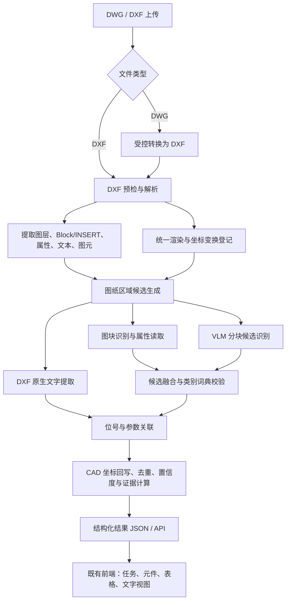

# 电气图纸元件识别可行技术方案

> **版本**：V1.3（可行性验证版，已与代码核对）  
> **日期**：2026-08-01  
> **目标**：验证从 DWG/DXF 电气图纸自动提取元件、文字、位置和证据的技术可行性，并将结果直接呈现在既有前端；不建设人工协同、审核或运营闭环。

> **实现状态说明**：本文既是当前执行方案，也是截至 2026-08-01 的代码实现对照基线。状态含义：**已实现**表示已有可调用代码和回归覆盖；**部分实现**表示流程或接口已存在，但尚未达到本文设计的全部约束；**未实现**表示明确留待后续阶段。三份“Gemini / GLM / DeepSeek 版”报告均为历史调研资料，不是当前实现规范。

---

## 1. 结论与范围

三份输入报告形成了互补结论：Gemini 版给出了“矢量为主、视觉为辅”的基础路线；GLM 版说明了 OBB 与 VLM 的价值；DeepSeek 版补充了图纸审计、量化指标、性能口径和开源合规风险。本版仅保留与**单用户自动化可行性验证**相关的内容。

建议采用**“DXF 矢量解析优先 + 通用视觉/多模态大模型候选识别 + 原生文字关联 + 坐标回写”**的混合路线。它保留 CAD 原始坐标的可追溯性，并兼容图块与由基本图元打散的符号。通用大模型用于规则、词典和结构化输出编排；多模态大模型（VLM）用于图纸区域理解、局部符号候选识别、类别解释和结构化 JSON 输出。专用 OBB 模型仅在本轮验证证明 VLM 的定位召回或延迟不能满足目标时再接入。

本轮只验证并交付**元件信息、原生文字和位置识别**，不以 Netlist、人工复核、多人协作、权限、通知、Webhook、BOM 一致性校验或图数据库为验收目标。标题栏和表格仅作为前端接口的空结果占位，待核心识别验证完成后再单独立项。

### 1.1 第一期输入与输出

**输入**

- DWG 或 DXF 文件；优先支持模型空间中的二维原理图。
- 可选：图框、BOM、既有图块命名规范和符号标准样本。

**输出**

```json
{
  "drawing_id": "B电气图",
  "components": [
    {
      "id": "cmp_001",
      "type": "resistor",
      "reference": "R1",
      "value": "10kΩ",
      "cad_center": {"x": 1250.30, "y": 846.10},
      "cad_bbox": [[1238.2, 840.0], [1262.4, 852.2]],
      "rotation_deg": 90,
      "source": "block|vision|fusion",
      "confidence": 0.98,
      "evidence": {"block_name": "RESISTOR", "text_ids": ["txt_013"]},
      "review_status": "approved|pending"
    }
  ]
}
```

坐标单位、坐标系、DXF 版本、转换工具版本与原文件哈希必须进入任务元数据，保证结果可复现。

### 1.2 第一阶段支持的元件类别

从高频、清晰、易验证的类别开始：`resistor`、`switch`（常开/常闭需单独类别）、`fuse`、`relay`、`connector`、`capacitor`、`diode`、`terminal`。类别字典由样本图纸确定并版本化；未知符号统一输出为 `unknown_symbol`，同时保留 VLM 候选类别与证据，不进入人工流程。

### 1.3 当前前端与 API 对齐

既有前端已确认“上传页 → 任务进度 → 结果页”的交互：结果页按元件、表格、文字三个标签展示，并在 1200 × 900 的 CAD 画布上叠加归一化边界框。因此后端以该界面为固定消费端，而不是新增管理端或审核工作台。

| 前端动作 | 接口 | 返回要点 | 当前实现 |
|---|---|---|---|
| 上传 DWG/DXF | `POST /api/upload` | `{ code, message, data: { taskId } }` | 已实现：创建持久化异步任务。 |
| 查询进度 | `GET /api/recognition/{taskId}` | 文件信息、`pending/processing/completed/failed`、进度、单页元数据 | 已实现：将后端运行态映射为前端状态。 |
| 元件标签 | `GET /api/recognition/{taskId}/symbols` | 类别、位号/参数、CAD 位置、置信度、颜色、归一化框 | 已实现：从识别结果投影到画布坐标。 |
| 表格标签 | `GET /api/recognition/{taskId}/tables` | 表格数组 | 已实现：本轮返回空数组，明确不验证 BOM/表格识别。 |
| 文字标签 | `GET /api/recognition/{taskId}/texts` | 原生 DXF 文本、图层、CAD 位置、归一化框 | 已实现：`TEXT/MTEXT` 直接输出。 |

接口成功响应统一为 `{ "code": 0, "message": "ok", "data": ... }`。前端画布目前绘制内置 CAD 示意图，故 `imageUrl` 保持空字符串；元件和文字框仍使用与现有画布一致的 1200 × 900 坐标空间。真实 DXF/DWG 底图渲染并接入 `imageUrl` 属于后续增强，不阻塞本轮识别结果验证。

为使已确认的登录页能够进入识别界面，后端还提供 `POST /api/auth/login` 的本地 UI 门禁响应。它只校验用户名和密码非空并返回本地令牌，不表示已实现用户、权限或多租户能力。

**已知接口偏差**：后端上传限制为 100 MB，而前端当前文案仍显示 50 MB，需在联调时统一；组件 DTO 已提供 CAD 中心点和前端归一化框，但尚未提供设计示例中的 `cad_bbox`；登录接口仅为本地非空门禁。

### 1.4 模型接口配置

后端从 `backend/.env` 读取 OpenAI 兼容模型配置，优先使用 `VLLM_OPENAI_BASE_URL`、`VLLM_OPENAI_API_KEY`、`VLLM_MODEL_NAME`，未设置时回退到 `OPENAI_BASE_URL`、`OPENAI_API_KEY`、`MODEL_NAME`。密钥绝不写入结果、日志或接口响应，且 `.env` 已排除在版本控制之外。

为防止常规 DXF 解析或离线测试意外产生外部模型调用，VLM 默认关闭。确认端点与模型具备图像输入能力后，在本地 `.env` 增加 `DRAWING_VLM_ENABLED=true` 才启用；未启用时服务仍执行矢量 Block/文字识别，若配置了本地 `DRAWING_OBB_MODEL` 则使用 OBB 对照基线。

### 1.5 当前实现状态总览

| 方案项 | 状态 | 当前实现与限制 |
|---|---|---|
| DWG/DXF 文件校验、上传和异步任务 | 已实现 | 支持扩展名白名单、100 MB 限制、本地持久化任务、轮询与 SSE 调试流。 |
| DWG 转 DXF | 已实现（依赖环境） | 已接入 ODA File Converter；未配置转换器时返回明确失败，不直接解析 DWG。 |
| DXF 审计、Block/属性、TEXT/MTEXT 提取 | 已实现 | 已审计图层、实体类型、未知 Block 和原生文字；以 Block 词典识别目标类别。 |
| 首期元件类别 | 部分实现 | 已落地 resistor、switch、fuse、relay、connector、capacitor、diode；`terminal` 仍归入 `connector`，矢量路径尚未输出 `unknown_symbol` 候选。 |
| CAD/像素坐标往返校验 | 已实现（基础变换） | 已覆盖轴对齐缩放和 Y 轴翻转的往返验证；裁剪、旋转、非等比渲染的完整仿射矩阵记录尚未实现。 |
| DXF 渲染、重叠切片、VLM/OBB 候选 | 部分实现 | 渲染、切片、可选 VLM/OBB 适配器和基础去重已存在；默认不启用模型，尚未形成真实样本对照评测。 |
| VLM JSON 约束与可追溯性 | 部分实现 | 当前使用 JSON 对象响应与代码级字段过滤；严格 JSON Schema、提示词/请求参数/图像尺寸的完整实验归档待补。 |
| 图块与文字关联、`approved`/`pending` | 部分实现 | 已实现 ATTRIB 优先、文本近邻和类别正则；方向、引线关系、候选竞争及双路冲突证据未完整实现。 |
| 前端结果 DTO | 已实现 | 已实现上传、任务、元件、文字、空表格接口和 1200 × 900 归一化框；真实图纸底图和 BOM 提取未实现。 |
| P0 审计和坐标验证 | 已实现 | 已有审计、坐标验证端点和 P0–P2 回归测试。 |
| 精确率/召回率/成本评测 | 未实现 | 尚无带真值数据集的自动指标流水线、性能分段计时或 VLM 与 OBB 对照报告。 |
| BOM、拓扑、Netlist、人工审核与生产化集成 | 未实现（范围外） | 保持为后续可选增强，不属于本轮验收。 |

---

## 2. 三份报告的评审结论

| 来源 | 可采用内容 | 需要调整或暂缓内容 |
|---|---|---|
| Gemini 版 | DWG 先转换为 DXF；提取图层、Block/INSERT、文字及图元；图块优先、视觉兜底；图像到 CAD 的坐标映射；文本邻近关联。 | 图层名不可作为主判定条件，只能作为弱特征；“Block 精度 100%”应改为“坐标精确、语义依赖图块词典与属性完整性”；DBSCAN 不能单独承担版面划分。 |
| GLM 版 | OBB/端子方向的重要性；VLM 适合零样本冷启动、局部区域理解和长尾符号分类；BOM/标题栏有后续价值。 | 当前目标只是验证元件、文字与位置，不应把连线追踪、SAM、Neo4j、SPICE netlist 或人工审核放进本轮范围；YOLOv8-OBB 与关键点检测通常需要独立模型或自定义多任务实现，不能表述为开箱即用的单一能力。 |
| DeepSeek 版（修订） | 图纸审计、分层量化指标、性能基线、异步集成和 LibreDWG 的 GPL 合规提示。 | 去除 HITL、生产化运营承诺及固定周期；本轮只比较通用大模型、VLM 和可选 OBB 基线，输出实际数据而非预设性能结论。 |

### 2.1 关键技术判断

1. **矢量通道是定位与审计的主通道。** DXF 内 `INSERT`、`ATTRIB`、`TEXT`、`MTEXT` 的坐标比视觉模型稳定；`LINE`、`LWPOLYLINE`、`ARC` 等图元也能为视觉结果提供校验。
2. **视觉通道解决“未打块/非标准画法”。** 先用 VLM 对渲染图的分块输出受限类别表、候选框和结构化说明；在同一组样本上与可选 OBB 基线比较召回、定位误差、耗时和成本。
3. **VLM 是本轮的主要 AI 验证资源。** 局部裁剪、固定类别表、JSON Schema、CAD 坐标回写和图块/文字规则共同约束其输出；通用大模型负责提示词、规则配置和结果解释，不能直接伪造坐标或证据。
4. **先做元件，再做拓扑。** 导线交叉、跳线、跨页连接、端子和符号内部线会使连通性恢复显著复杂。需先以“元件识别准确率、位号关联准确率、CAD 坐标误差”为核心指标。
5. **不确定性是验证输出的一部分。** 低置信度、冲突和未知类别直接以 `pending` 状态及完整证据返回前端，不建设审核队列、编辑接口或数据回流。
6. **模型版本在 P0 评测后记录而非预先冻结。** 记录通用模型、VLM、提示词、温度、图像尺寸、词典与可选 OBB 基线的版本；以真实样本的可复现实测结果决定后续是否训练专用模型。

---

## 3. 总体架构



### 3.1 模块职责

| 模块 | 第一阶段实现 | 关键约束 |
|---|---|---|
| 文件接入 | 文件哈希、格式白名单、DWG 转 DXF、任务记录 | DWG 转换器要隔离运行；商用授权、部署方式和可支持 DWG 版本在选型时确认。 |
| DXF 解析 | 使用 `ezdxf` 读取实体、块定义、属性、布局、单位和范围 | `ezdxf` 解析 DXF，不直接承担 DWG 解析；转换失败应返回明确状态。 |
| 坐标服务 | 记录 CAD 范围、渲染尺寸、缩放、Y 轴翻转和裁剪偏移 | 不假设单一仿射参数覆盖所有布局；分块结果先回写至整图像坐标，再映射 CAD。 |
| 图块识别 | `INSERT` + Block 名称词典 + `ATTRIB` 属性解析 | 未知 Block 不直接映射到业务类别；保留原始名称与证据。 |
| 图像检测 | 切片、重叠、VLM 局部识别、跨切片去重；可选 OBB 对照 | 图纸通常超大，不能直接等比缩小整图后检测；每次调用必须记录提示词、图像尺寸和模型版本。 |
| 文字关联 | DXF 原生文字优先，OCR 补充；距离、方向、引线与规则评分 | 不以“最近文本”作为唯一规则，避免将相邻元件位号错误绑定。 |
| 融合与输出 | 证据保留、置信度融合、冲突标记、前端 DTO 映射 | 不用不同来源的置信度直接相加；冲突只以 `pending` 和原因返回，不进入人工流程。 |

### 3.2 非功能要求与集成边界

- **异步任务**：上传 API 只完成校验、存储和任务创建；转换、渲染和模型推理在本地 Worker 执行。前端轮询任务状态；SSE 是调试接口，不构成外部集成承诺。
- **性能口径**：P0 建立基线并分别记录转换、解析、渲染、VLM、可选 OBB 和 DTO 导出耗时；不预设服务级目标、并发目标或 Webhook。
- **可追溯性**：每个输出保留输入哈希、转换器/模型/词典版本、坐标变换、候选证据、审核人和审核时间；下游仅消费已发布版本的 JSON。
- **合规**：对 DWG 转换器、检测模型、OCR、VLM 与字体分别建立许可证清单。LibreDWG 的 GPL 许可仅作为隔离的开发/验证选项，进入生产前必须完成法务评估。

**现状补充**：异步本地 Worker、前端轮询和 SSE 调试流已经实现；转换、解析、渲染、VLM/OBB 与 DTO 导出的分段耗时尚未作为任务元数据持久化，许可证清单也尚未形成可查询台账。

---

## 4. 识别流程设计

### 4.1 预处理与坐标映射

1. 对上传文件计算 SHA-256，创建识别任务和不可变输入记录。
2. DWG 通过已批准的转换器转换为 DXF；保留原 DWG、DXF 和转换日志。
3. 解析 DXF 的模型空间与布局，记录 `$INSUNITS`、实体范围、图层、文字、Block 和 INSERT。
4. 分布局渲染高 DPI 图像，并将渲染参数写入 `CoordinateTransform`：

$$
X_{cad}=X_{min}+\frac{x_{px}}{s_x},\qquad
Y_{cad}=Y_{max}-\frac{y_{px}}{s_y}
$$

其中 $s_x,s_y$ 是像素/图纸单位缩放比例。若渲染时发生裁剪、旋转或非等比缩放，则记录完整仿射矩阵并使用矩阵逆变换，不能只套用上式。

5. 依据图框、实体密度、文字/表格区域和可配置图层权重形成候选区域；图层名称与 DBSCAN 都仅作候选特征，不作为硬编码前提。

**当前差距**：已实现范围驱动的轴对齐坐标变换及四点往返校验；尚未落盘每次渲染的裁剪偏移、旋转与完整仿射矩阵，也尚未实现图框/实体密度驱动的候选区域划分。

### 4.2 元件候选生成与融合

**路径 A：矢量图块识别（优先）**

- 遍历 `INSERT`；将 Block 名称经可版本化的别名词典映射至标准类别。
- 读取 `ATTRIB`、扩展属性及插入变换，计算插入点、外接范围和旋转方向。
- 将“已知词典命中 + 合法属性/几何”标为高置信度；名称模糊或块定义异常时保留为 `pending`，并继续交给 VLM 给出候选类别与理由。

**路径 B：VLM 局部候选识别（本轮主验证路径）**

- 以固定物理尺度或像素尺度切片，使用约 10%–20% 重叠避免边界漏检。
- 对每个切片传入受控类别表、像素坐标格式和严格 JSON Schema，要求 VLM 输出类别、候选框、方向、置信度、文字线索和理由。
- 通过跨切片的 IoU、中心距离及 DXF 几何/文字邻近度合并候选。不能通过坐标、Schema 或证据校验的 VLM 响应一律丢弃并记录失败原因。

**当前差距**：切片、可选 VLM 调用和基础去重已具备，但当前以 JSON 对象模式和代码解析过滤替代严格 Schema；跨切片融合尚未使用 IoU、几何/文字证据，失败原因和模型调用元数据尚未完整归档。

**路径 C：可选 OBB 对照基线**

- 如环境中已有可用模型，按与 VLM 完全相同的切片和真值样本运行 OBB 检测器。
- 它不是首期依赖项；只有实测证明其在定位误差、召回或成本上显著优于 VLM，才进入后续专用模型训练路线。

**融合规则**

- 同位置图块与视觉类别一致：以图块的 CAD 几何为主，提升置信度。
- 图块存在但名称未知：保留为未知候选，允许视觉分类提供建议，不覆盖原始证据。
- 视觉候选未与图块重叠：作为非规范符号候选输出。
- 图块与视觉类别冲突：保留两路证据，结果标记为 `pending`，并正常返回前端用于可行性对比。

### 4.3 位号与参数关联

优先级为：`ATTRIB` → DXF `TEXT/MTEXT` → OCR 文字。对每个元件在局部搜索窗口内计算文本关联评分：

$$
Score(c,t)=w_d\cdot f(\text{distance})+w_o\cdot f(\text{relative direction})+w_r\cdot f(\text{reference pattern})+w_l\cdot f(\text{leader relation})
$$

- 搜索窗口以 CAD 图纸单位和当前元件尺度配置，而不是固定像素；`reference pattern` 由元件类别限定，如电阻优先匹配 `R\d+`，开关优先匹配 `S\d+`、`SA\d+` 等经业务确认的规则。
- 若最高分与次高分过近、文本被多个元件竞争或文本不符合格式，关联状态为 `pending`。
- 结果必须保存候选文本、评分、最终选择和模型证据，供离线评测与可重复实验追溯。

### 4.4 置信度与自动输出策略

| 结果 | 条件示例 | 处理 |
|---|---|---|
| 自动输出 | 已知图块词典命中、属性有效、无 VLM 冲突；或 VLM 坐标、类别和文字关联均通过校验 | 标记 `approved`，直接输出到前端。 |
| 不确定输出 | VLM 置信度中等、文字关联歧义、未知图块或相邻符号重叠 | 标记 `pending`，仍输出候选、原因和全部证据。 |
| 冲突输出 | 图块和 VLM 类别不一致、同一位号重复、坐标映射越界 | 标记 `pending`，附带冲突原因；不创建审核任务。 |

阈值不可写死。使用独立验证集按类别校准，并在每次实验输出中记录阈值、模型版本和提示词版本；本轮不以人工处理量或运营成本优化阈值。

---

## 5. 数据、模型与评测

### 5.1 数据建设路线

1. 收集覆盖实际来源、图框、比例、图层习惯、扫描质量和符号方向的代表性 DXF/DWG 样本；按“图纸”而非“切片”划分训练/验证/测试集，避免泄漏。
2. 对至少 50 张、按图纸来源和类型分层抽样的样本执行图纸审计，确认规范块占比、块名称长尾、文本属性完整率、符号打散率和图层规范度。这是评估标注成本的首要工作，而不是固定规模的训练集承诺。
3. 用图块实例和少量离线真值构造对照集；VLM 用于非标符号候选生成。真值只用于计算指标和比较技术路径，不建设在线标注或审核功能。
4. 对视觉数据做旋转、缩放、线宽、噪点、压缩和局部遮挡增强，但不得改变位号与元件关系。
5. 优先分析低置信度、冲突和模型分歧样本，形成下一轮提示词、词典或模型选型的输入。

标注集规模由 P0 审计和学习曲线决定：先标注覆盖每类符号、每种方向和每个主要图纸来源的最小代表集，训练基线后按错误类型定向补标；不在缺少类别分布依据时预设“真实标注 1000 张”。

### 5.2 建议验收指标

| 指标 | 说明 | 第一阶段建议目标 |
|---|---|---|
| 元件检测召回率 | 测试图纸中目标元件被发现的比例 | 高频类别 ≥ 95% |
| 元件检测精确率 | 自动输出中真实目标元件比例 | 高频类别 ≥ 95% |
| 类别准确率 | 已匹配候选类别正确比例 | 高频类别 ≥ 95% |
| 位号关联准确率 | 元件绑定正确位号比例 | ≥ 90%，歧义项以 `pending` 输出 |
| CAD 中心坐标误差 | 与人工/矢量真值的距离 | 图块路径为 0 或接近数值误差；视觉路径按图纸单位另行约定阈值 |
| `approved` 错误率 | `approved` 结果中错误比例 | ≤ 1%，以独立测试集计算 |
| `pending` 比例 | 有歧义、冲突或验证失败的输出比例 | 记录并按错误类型解释，不设置人工处置目标 |

“99% 准确率”必须明确到类别、指标、测试集范围和 `approved/pending` 口径，不能作为未定义的总体承诺。

**当前状态**：已具备图纸审计、坐标往返验证及 P0–P2 冒烟回归测试；尚未建立带独立真值集的召回率、精确率、类别准确率、`approved` 错误率、耗时和成本自动评测流水线。因此本表为验收设计目标，而非已验证的性能结论。

---

## 6. 分期实施计划

### P0：样本审计与接口连通（1 周）

- 对至少 50 张分层样本（若现有库存不足则记录实际数量与偏差）解析 Block、图层、文字实体、实体类型与布局统计。
- 验证选定转换器对样本 DWG 的版本兼容性、许可和可部署性。
- 完成 DXF 渲染及像素/CAD 坐标往返校验。
- 跑通前端的上传、轮询、元件/表格/文字结果接口，并确认画布归一化坐标方向正确。
- 交付：图纸特征审计报告、元件词典草案、最小 JSON Schema、API 联调结果和基线报告。

**准入条件**：能稳定解析样本；明确规范块占比和至少 6 类目标元件的标注定义。

### P1：矢量优先自动 MVP（1–2 周）

- 实现上传、转换、DXF 解析、Block/属性识别、文字关联、结果查询和任务进度。
- 将未知 Block、缺属性和冲突结果以 `pending` 及证据字段直接输出。
- 交付：可处理规范图块图纸的端到端服务，以及与既有前端一致的 API DTO。

### P2：VLM/OBB 对比验证（1–2 周）

- 构建小型独立对照集，接入 VLM 分块识别、去重和坐标回写。
- 在可用时运行 OBB 对照基线；不因缺少训练数据阻塞 VLM 验证。
- 交付：支持打散符号的候选检测能力，以及按类别、定位误差、耗时和成本比较的评测报告。

### P3：结论固化（按 P0–P2 结果决定）

- 汇总真实图纸上的可行性结论、失败样本、性能分解与下一步建议。
- 判断是否值得投入专用 OBB 训练、OCR 或真实图纸底图渲染；不建设协同、审核、通知或生产运营能力。
- 交付：技术验证报告和可复现实验配置。

### P4：可选增强（后续）

- BOM/标题栏结构化与一致性校验。
- 元件端子关键点、矢量导线追踪、跨页连接和拓扑图。
- 在拓扑准确率达到独立验收门槛后，才考虑 Netlist 或图数据库输出。

---

## 7. 项目落地边界与代码组织建议

当前工作区已有 FastAPI 后端、React/Vite 前端、上传页、任务轮询、结果页和画布叠加效果。识别领域代码已位于 `backend/` 下，前端通过 `/api` 消费固定 DTO；本轮只补齐两者之间的自动化接口，不新增管理端、协同端或审核端。

建议新建如下逻辑边界（具体目录会在代码实施时按既有项目约定落定）：

```text
backend/
  ingest/          # 文件校验、转换器适配、任务输入
  cad/             # DXF 实体解析、图块与坐标变换
  rendering/       # 渲染、切片、叠加可视化
  recognition/     # 图块规则、VLM/可选检测器适配器
  fusion/          # 候选去重、文字关联、置信度与证据
  domain/          # Pydantic 领域模型与 JSON Schema
  evaluation/      # 数据集、指标和回归评测
  runtime/         # 单机任务持久化、Worker 与事件进度（P1）
  service.py       # 识别流程编排
  api.py           # 详细识别 API 与前端兼容 API
  main.py          # 独立服务入口
  data/            # 运行时任务记录和受控样本索引，不提交模型权重

frontend/src/
  pages/Upload/     # 上传、任务历史和轮询
  pages/Result/     # 元件、表格、文字和画布叠加展示
  api/              # /api/upload 与 /api/recognition 客户端
```

- 上传和任务进度复用现有本地 Worker；该实现只服务于验证任务，不承诺分布式队列、SSE 推送、对象存储或生产并发能力。
- 前端负责上传、查看状态和查看自动识别结果；`pending` 只表示机器不确定，并不触发人工处理。
- 原始图纸、转换产物、模型响应和实验配置保存在受控本地目录，不提交模型权重。

---

## 8. 主要风险与控制

| 风险 | 控制措施 |
|---|---|
| DWG 兼容性与商业许可 | 在 P0 用真实样本验证转换器；法务确认转换器和模型许可证；保留可替换适配层。 |
| 图纸规范参差不齐 | Block 统计先行；不依赖固定图层名；非规范图纸走 VLM 分块候选识别并输出 `pending` 证据。 |
| 超大图纸导致漏检 | 固定尺度切片、重叠推理、跨片去重；保存切片与坐标变换证据。 |
| 文字错配 | 原生 DXF 文本优先、多特征评分、类别正则约束、歧义不自动通过。 |
| 模型数据不足 | 图块弱监督、小型离线对照集、VLM 零样本提示词迭代；按图纸来源拆分测试集。 |
| 坐标失真 | 进行至少四个已知锚点的往返校验；每次渲染都记录矩阵和裁剪参数。 |
| 一期范围膨胀 | 将人工协同、审核、拓扑、BOM、SAM、Neo4j、Netlist 和生产化集成排除在本轮之外。 |

---

## 9. 下一步

1. 补齐 `cad_bbox`、独立 `terminal` 类别和矢量 `unknown_symbol` 候选，使结果契约与本方案一致。
2. 统一前端 50 MB 文案与后端 100 MB 限制，并以真实 DXF 验证任务状态、元件框、文字框和 Y 轴方向。
3. 持久化渲染坐标参数、模型/提示词版本、图像尺寸、失败原因及各阶段耗时，形成可复现实验记录。
4. 基于 P0 审计样本建立独立真值对照集，在同一批图纸上比较 VLM 分块与可选 OBB 的召回、定位误差、耗时和成本，再决定是否训练专用模型。
