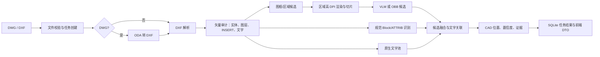

# 电气图纸元件识别：当前架构评审与改进路线

> **版本**：V2.0（代码复核与技术调研版）  
> **日期**：2026-08-03  
> **目标**：从 DWG/DXF 电气图纸中稳定提取**元件、文字、CAD 位置和可追溯证据**，并在既有前端正确叠加展示结果。

---

## 1. 结论

当前项目已具备从文件接入到前端展示的可运行骨架：DWG 转 DXF、DXF 审计、规范 `INSERT` 元件识别、原生文字提取、区域级高 DPI 渲染、VLM/OBB 适配、异步任务和前端结果接口均已存在。

但它尚不是可验证的“电气图纸识别能力”。决定目标能否达成的关键缺口有四项：

1. **无 `INSERT` 的打散符号没有可靠主路径。** 当前只能依赖尚未完成真实验证的 VLM/OBB；视觉不可用时会得到 0 个元件。
2. **中文文字恢复链路不完整。** 仅提取顶层 `TEXT/MTEXT`；块内文字、`ATTRIB` 独立输出、轮廓化文字和 OCR 尚未形成统一文字池。
3. **CAD 坐标到 PNG/前端的真实投影未固化。** 当前归一化框以识别点集合为范围，不是以渲染视口和裁剪变换为依据，因此不能保证精确贴合底图。
4. **没有真实图纸真值集和评测闭环。** 现有回归测试主要证明流程连通，不能证明 15 类元件在真实图纸上的召回率、准确率或位置误差。

因此，近期投入应优先建立“可测量、可校准的混合识别链路”，而不是扩展 BOM、拓扑、人工审核、用户体系或生产化能力。

---

## 2. 当前技术架构



### 2.1 当前代码边界

| 模块 | 责任 | 当前结论 |
|---|---|---|
| `ingest/` | 文件校验和 DWG 转 DXF | ODA 转换已接入；转换产物、日志、文字保真检查未持久化。 |
| `cad/` | DXF 审计、顶层实体与 Block 解析、坐标模型 | 可解析顶层 `TEXT/MTEXT` 和 `INSERT`；未递归抽取块内文字。 |
| `rendering/` | DXF 渲染、区域检测、切片 | 已支持系统中文字体映射、区域高 DPI 渲染；区域规则仍较窄。 |
| `recognition/` | 元件目录、VLM/OBB/OCR 适配器 | 15 类目录、VLM/OBB 调用框架已有；OCR 仅占位，OBB 未配置可验证权重。 |
| `fusion/` | 属性/文字关联、候选组装 | 已有 ATTRIB 优先与近邻文字规则；冲突融合和多候选全局优化不足。 |
| `runtime/`、`api.py` | 任务、事件、前端兼容接口 | 已可端到端运行；证据和真实渲染变换未完整暴露。 |
| `evaluation/`、`tests/` | 冒烟与回归验证 | 已覆盖合成样本和接口流程；缺真实图纸真值评测。 |

---

## 3. 已实现能力清单

以下能力已有代码和回归覆盖；“已实现”只表示功能存在，不等同于识别准确率已通过真实样本验证。

### 3.1 文件、任务与接口

- DWG/DXF 扩展名和大小校验，上传后创建 SQLite 持久化任务。
- 异步任务状态、阶段事件、轮询接口和 SSE 调试流。
- DWG 经 ODA File Converter 转换为 DXF；未配置转换器时返回明确失败。
- 前端上传、任务查询、底图、元件、文字和空表格接口已连通。
- 后端读取实际 PNG 尺寸；前端按原始比例缩放底图，不再固定拉伸为 `1200 × 900`。

### 3.2 矢量解析与规则识别

- 审计模型空间实体类型、图层、未知 Block、顶层 `TEXT/MTEXT`。
- 基于 `INSERT`、Block 别名和 `ATTRIB` 的规范元件识别。
- 15 个业务类别、英文稳定类型、中文名称、业务分类和参考素材映射。
- `ATTRIB` 优先、近邻原生文字和类别正则的位号/参数关联。
- CAD 坐标的轴对齐缩放和 Y 轴翻转往返测试。

### 3.3 图像与视觉候选路径

- `ezdxf` + Matplotlib DXF 渲染。
- 配置式中文字体覆盖：默认尝试本机 `simhei.ttf`；它只影响仍是文字实体的内容，不能恢复已变为线段、填充或轮廓的中文。
- 大型封闭、轴对齐四点 `LWPOLYLINE` 图框的区域候选检测。
- 每区域按 `DRAWING_VISION_DPI`（默认 450）渲染并以 `1536 px`、`192 px` 重叠切片。
- OpenAI 兼容 VLM 适配器、Excel 图标参考提示、可选 Ultralytics OBB 适配器和 VLM 失败后的 OBB 回退。
- 区域内同类别 IoU 去重，以及像素检测框回写到区域 CAD 范围。

### 3.4 当前已验证范围

- P0–P2 回归测试覆盖文件流程、规范 Block 小样本、渲染/切片、区域候选、VLM 响应过滤与失败降级。
- 这不覆盖真实打散电气图、轮廓化中文、真实 VLM 服务或已训练 OBB 权重，不能据此宣称识别准确率。

---

## 4. 尚未实现或未完成部分：按目标影响排序

排序依据是对“元件、文字、位置和证据可靠输出”的直接影响，而非实现难度。

| 优先级 | 缺口 | 对目标的影响 | 建议完成标准 |
|---|---|---|---|
| P0 | 无 `INSERT` 图纸的可靠元件识别 | 当前样本类型可能直接返回 0 个元件，是主目标的最大阻塞。 | 为真实打散图建立矢量候选或已训练视觉模型；在独立真值图上报告每类召回、精确率与定位误差。 |
| P0 | 真实渲染坐标变换与前端叠加校准 | 框可能与底图不一致，导致位置结果不可用或不可审计。 | 每次渲染持久化 CAD 范围、像素范围、裁剪、边距和仿射矩阵；以已知实体锚点自动验证。 |
| P0 | 文字恢复与统一文字池 | 中文位号、参数和设备名称缺失会破坏元件关联与可读性。 | 递归提取块内文字和 `ATTRIB`；对原生文字稀缺区域执行 OCR；统一保存文本、框、来源和置信度。 |
| P0 | 最小真实图纸真值集与评测 | 没有客观指标，无法判断方案是否改善或选择 VLM/OBB。 | 按图纸来源划分训练/验证/测试；输出类别级 precision、recall、定位误差、文字准确率、耗时和成本。 |
| P1 | 证据模型贯通到 API 与前端 | `pending`、冲突、文字依据和视觉来源未完整展示，结果无法追溯。 | 元件 DTO 提供 `source`、`review_status`、候选框、关联文本、冲突原因、模型/切片证据。 |
| P1 | VLM 严格输出合同与失败分型 | 仅靠 JSON 对象模式和宽松解析，模型输出漂移时难以稳定运行。 | 对请求和响应采用版本化 JSON Schema；校验类别、坐标范围、置信度和最大候选数；记录拒绝原因。 |
| P1 | 分区鲁棒性与跨区域去重 | 当前仅能识别四点轴对齐多段线图框，复杂版面容易整图回退或重复。 | 支持 `LINE` 组合框、嵌套/旋转框、实体密度候选；按 CAD 坐标跨区域去重。 |
| P1 | DWG 转换可追溯与中文保真检查 | 转换后中文是否语义丢失无法定位，也难以复现。 | 保留 DXF、转换器版本、标准输出/错误、输入输出哈希；统计转换前后文本实体与字体依赖。 |
| P2 | 文字关联的方向、引线与竞争约束 | 仅“最近文字”会把相邻设备的位号错配。 | 联合距离、方向、引线、类别正则和全局一对一匹配；歧义输出 `pending`。 |
| P2 | 真实 OBB 训练与部署 | 当前 OBB 只是接口；没有自定义权重即没有识别能力。 | 用真实/合成切片做四点 OBB 标注，训练并在独立图纸上评测；再决定是否部署。 |
| P3 | BOM、标题栏、拓扑、Netlist、人工审核、用户权限 | 与本轮元件/文字/位置目标无直接关系。 | 仅在 P0–P2 指标稳定后单独立项。 |

### 4.1 必须明确的运行时降级

当图纸 `INSERT=0` 且 VLM 未启用、VLM 请求失败且 OBB 未配置有效权重时，服务不应仅返回“成功、0 个元件”。应在结果中明确标记：**当前图纸需要视觉/矢量打散符号识别能力，机器未获得可用识别器**。这能避免把“未识别”误解成“图纸没有元件”。

---

## 5. 推荐的改进技术方案

### 5.1 首选路线：矢量优先、视觉补盲、证据统一

不建议把所有 DXF 直接栅格化后交给 VLM。对于 CAD 图纸，更稳健的路线是：

1. **保留和扩展原生矢量信息。** 解析 `INSERT`、`ATTRIB`、`TEXT/MTEXT`、块定义、图元几何、图层和文字样式。
2. **为打散符号建立矢量候选生成器。** 从 `LINE`、`LWPOLYLINE`、`ARC`、`CIRCLE`、`HATCH` 构造局部连通子图，以符号局部范围、端点、拓扑和几何描述子生成候选；再用参考符号、VLM 或分类器判类。
3. **仅对候选区域做高分辨率视觉。** 视觉模型验证或补充矢量候选，而非扫描整图的所有内容；降低成本并保留 CAD 坐标可解释性。
4. **统一融合模型。** 每条元件和文字证据带来源、范围、置信度、转换链、模型版本；融合后明确 `approved`、`pending` 或 `unavailable`。

该路线能直接改善当前“图元已打散，Block 识别为空”的核心问题，也能减少 VLM 在密集整图中定位不稳定的问题。

### 5.2 坐标服务：从比例估算升级为可审计投影

为每次整图和区域渲染生成不可变 `RenderTransform`：

```text
CAD extent + 视口范围 + figure 尺寸 + DPI + 轴方向 + 裁剪矩形 + 边距
                    ↓
         CAD ↔ region pixel ↔ tile pixel ↔ frontend pixel
```

- 渲染函数应返回 PNG 路径和该变换对象，而不是只返回文件路径。
- 切片要记录其左上像素偏移；检测框先从 tile 回写到 region，再回写到 CAD。
- 前端归一化框应由 CAD 框经同一变换得到，而非依据本批结果点的最小/最大值。
- 每张图至少选择四个已知 CAD 锚点，自动验证其像素误差；超过阈值时将视觉结果降为 `pending`。

`ezdxf` 的 Drawing Add-on 采用 Frontend/Backend 两段式渲染，并提供记录绘制结果与布局坐标变换的能力；其官方文档也明确提示不同字体会造成字形与位置差异。因此，坐标变换必须由渲染链路实际产出，而不能仅由 DXF 外接范围推导。

### 5.3 中文文字：原生优先、选择性 OCR 补偿

建议建立一个统一的 `TextEvidence` 结构：

```json
{
  "text": "QF1",
  "cad_polygon": [[0, 0], [1, 0], [1, 1], [0, 1]],
  "source": "attrib|native_text|block_text|ocr",
  "confidence": 0.99,
  "style": "simhei.ttf",
  "region": "region_01"
}
```

处理顺序：

1. 顶层 `TEXT/MTEXT`；
2. `INSERT` 的 `ATTRIB` 作为独立文字；
3. 递归遍历 Block 定义，应用插入的平移、缩放、旋转；
4. 对“原生文字数量异常少”或“转换后出现大量轮廓文字”的区域，执行 OCR；
5. 以 CAD 坐标、区域、方向和置信度合并重复文字。

OCR 应只处理候选区域或文字稀缺区域，避免对整张图做高成本、低收益 OCR。现代 OCR 服务可返回词/行的多边形和置信度，可直接进入上述统一模型；对中文电气图还应通过字典、位号正则和字符集约束做后校验。

字体映射仍应保留，但只能解决“DXF 仍存为文本而本机缺少字体”的显示问题；DXF 对字体通常只保存文件名，环境缺失 SHX/TTF 时无法保证替代字体与原字形度量一致。

### 5.4 图纸区域识别：多策略候选，而非单一图框规则

按可靠性依次组合：

1. DXF 中的闭合多段线或矩形图框；
2. `LINE`/`LWPOLYLINE` 的共线端点合并，组成矩形或近矩形；
3. 利用实体空间密度与留白分隔形成候选区域；
4. 对低分辨率预览图做边缘检测和 Hough 直线检测，作为矢量图框缺失时的后备；
5. 使用标题栏、文字密度和尺寸规则对区域打分，过滤表格、注释和边框嵌套。

每个区域都保存 CAD 范围、选择理由、渲染参数、切片和候选数。区域之间重叠时，在 CAD 坐标系执行类别感知 NMS/融合，避免重复元件。

### 5.5 视觉模型：VLM 用于冷启动，定制 OBB 用于稳定定位

- **VLM**：适合快速验证类别、解释模糊符号和为候选打标签；必须使用严格结构化响应、固定类别表、图像尺寸和坐标格式校验。
- **定制 OBB**：适合符号任意方向和密集布局下的稳定定位，但需要自有标注数据。OBB 标签应保存四个角点；预测框可保留旋转角和四点坐标，再投影到 CAD。
- **不建议直接使用通用 OBB 预训练权重作为电气符号识别结论。** 其预训练类别与电气图符号并不匹配，只适合作为模型初始化或工程验证。
- **主动学习闭环**：从 `pending`、VLM/矢量冲突、低置信度和高价值图纸中采样标注，而非盲目扩大数据量。

---

## 6. 最小可行实施计划

### 阶段 A：先建立可测量底座（P0）

1. 实现并持久化 `RenderTransform`，改造前端框投影。
2. 增加 `ATTRIB` 独立输出、块内文字递归提取和统一 `TextEvidence`。
3. 设计真实图纸标注格式，至少覆盖规范 Block、打散符号、中文文字、旋转/密集区域。
4. 实现评测：元件 precision/recall、类别准确率、文字准确率、CAD 中心误差、框 IoU、分阶段耗时与每图成本。
5. 对视觉不可用的无 Block 图纸返回明确 `unavailable` 限制，而非静默 0 结果。

**阶段完成条件**：可复现运行；坐标误差有量化结果；每个输出带来源；能区分“未检出”与“识别器不可用”。

### 阶段 B：解决真实打散图识别（P1）

1. 实现矢量局部候选生成和符号几何特征。
2. 扩展区域检测并增加 CAD 跨区域去重。
3. 接入选择性 OCR，完成文字与元件的方向/引线/竞争关联。
4. 让 VLM 使用版本化 Schema，并归档提示词、模型、图像和拒绝原因。

**阶段完成条件**：真实打散图不再只能依赖整图 VLM；在验证集上能给出基线指标和失败样本。

### 阶段 C：选择并训练稳定视觉基线（P2）

1. 基于阶段 B 的区域/切片和标注导出 OBB 数据集。
2. 训练并评测定制 OBB，与 VLM 在同一独立测试集比较。
3. 采用按类别和定位误差的融合策略，而不是仅以单一置信度阈值决策。

**阶段完成条件**：选择 VLM、OBB 或融合的依据是独立评测结果，而不是主观观感。

---

## 7. 不纳入当前目标的内容

以下内容对“元件、文字、位置、证据”首要目标没有直接贡献，应从当前技术路线中移除，待识别指标稳定后再评估：

- BOM/标题栏结构化与一致性校验；
- 导线追踪、端子连接、跨页关系、拓扑、Netlist 和图数据库；
- 人工审核队列、协作、用户、权限、通知、Webhook；
- 分布式队列、对象存储、多租户、服务级别承诺；
- 未经真实数据集评测的准确率承诺。

---

## 8. 技术调研依据

本轮建议结合代码现状和下列官方资料形成：

- [ezdxf Drawing / Export Add-on](https://ezdxf.readthedocs.io/en/stable/addons/drawing.html)：渲染由 Frontend/Backend 两阶段组成，支持记录绘制结果、布局与坐标变换；文档也说明字体差异会影响文字呈现。
- [ezdxf Font Resources](https://ezdxf.readthedocs.io/en/stable/concepts/fonts.html)：DXF 通常只保存字体文件名，缺少源 SHX/TTF 时替代字体不保证字形度量一致。
- [Microsoft Azure Vision OCR](https://learn.microsoft.com/en-us/azure/ai-services/computer-vision/concept-ocr)：OCR 结果可提供行、词、多边形和置信度，适合作为原生 DXF 文字的补充证据，而不是替代。
- [PaddleOCR Text Recognition](https://www.paddleocr.ai/latest/en/version3.x/module_usage/text_recognition.html)：当前本地 OCR 路线可返回识别文本和置信度，并提供简体中文等多语言模型；适合在受控区域内作为云端 OCR 的可替换实现。
- [Ultralytics Oriented Bounding Boxes](https://docs.ultralytics.com/tasks/obb/)：OBB 使用四点标注/旋转框输出，适用于任意方向对象；电气符号仍需要自有类别数据训练和独立验证。
- [OpenCV Hough Line Transform](https://docs.opencv.org/4.x/d9/db0/tutorial_hough_lines.html)：可作为图框缺失时的低分辨率线段检测后备，不应取代 DXF 原生几何解析。

> 调研结论：没有单个通用 VLM、OCR 或 OBB 模型能替代 CAD 原生解析、真实坐标校准和领域真值评测。最具性价比的改进是将它们放进可验证的混合证据链中。
